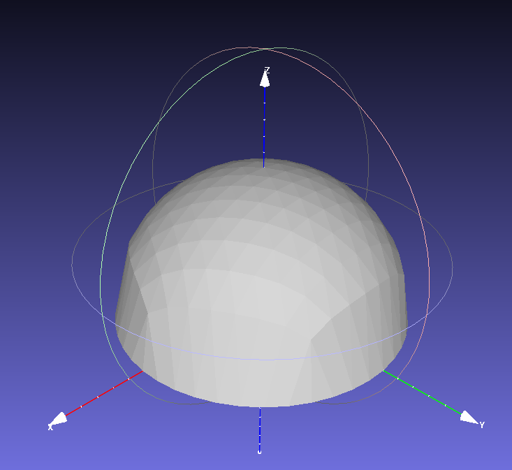

# snp_tpp: Scan N Plan Tool Path Planning

The following command can be used to run the path generation server from the command line:
```
ros2 run snp_tpp snp_tpp_node
```

The following command can be used to call the path generation service from the command line:
```
ros2 service call /generate_tool_paths snp_msgs/srv/GenerateToolPaths "{mesh_filename: /absolute/path/to/filename.ply, line_spacing: 0.1, min_hole_size: 0.225, min_segment_length: 0.75, point_spacing: 0.05, search_radius: 0.125}"
```

Instead of calling directly from the command line, you can use rviz.  Launch rviz, add a PoseArray display on "compressed_path".  Run the test node in another terminal (you will need to change the path to a mesh you have.)  The paths should appear in rviz.
```
ros2 run rviz2 rviz2
```
```
ros2 run snp_tpp snp_tpp_test
```

For example, path generation on this mesh output these paths in rviz:


