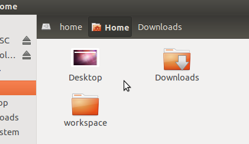
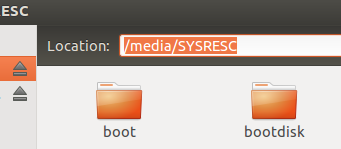

# Exploring the Linux File System
> In this exercise, we will look at how to navigate and move files in the Linux file system using the Ubuntu GUI, and learn some of the basics of Linux file attributes.

## Using the File Browser to Navigate

 1. Open the folder browser application we opened in the [previous exercise](Navigating-the-Ubuntu-GUI.md). You should see an window like the one below. The icons and text above the main window show the current location of the window in the file system. 

 

 2. The icons at the top constitute the "location bar" of the file browser. While the location bar is very useful for navigating in the GUI, it hides the exact location of the window. You can show the location by pressing _Ctrl+L_. You should see the location bar turn into something like the image below: 

 

 3. The folder browser opens up in the user's home folder by default. This folder is typically _/home/<username>_, which in the ROS-Industrial training computer is _/home/ros-industrial_. This folder is the only one which the user has full access to. This is by design for security's sake.

 4. By default, the file browser doesn't show hidden files (files which begin with a . character) or "backup" files (which end with a ~ character). To show these files, click on the "View" menu, and select "Show Hidden Files" (or press Ctrl+H). This will show all of the hidden files.  Uncheck the option to re-hide those files.

 5. Two hidden directories are _never_ shown: The . folder, which is a special folder that represents the current folder, and .., which represents the folder which contains the current folder. These will become important in the [next exercise](The-Linux-Terminal.md).

 6. On the left hand side of the window are some quick links to removable devices, other hard drives, bookmarks, etc. Click on the "Computer" shortcut link. This will take you to the "root" of the file system, the / folder. All of the files on the computer are in sub-folders under this folder.

 7. Double click on the _opt_ folder, then the _ros_ folder. This is where all of the ROS software resides. Each version is stored in its own folder; we should see a "melodic" folder there. Double-click on that folder. The _setup.bash_ file will be used in the [terminal exercise](The-Linux-Terminal.md) to configure the terminal for ROS. The programs, data, etc. are in the _bin_ and _share_ folders. You generally do not need to modify any of these files directly, but it is good to know where they reside.

## Making Changes

### Copying, Moving, and Removing Files

 1. Create a directory and file

    1. Make a directory  _\<Home\>/ex0.3_. We will be working within this folder.

       * Inside the file browser, click on the "Home" shortcut in the left sidebar.
       * Right click in the file browser's main panel and select "New Folder".
       * Name the folder "ex0.3" and press "return".

    1. Make a file _test.txt_ inside the newly-created _ex0.3_ folder.

       * Double-click on the _ex0.3_ folder.  Note how the File Browser header changes to show the current folder.
       * Right click in the file browser's main panel and select "New Document", then "Empty Document".
       * Name the file "test.txt" and press "return".

 1. Copying Files

    1. Copy the file using one of the following methods:

       * Click and hold on the _test.txt_ file, hold down on the control key, drag somewhere else on the folder, and release.
       * Click on the file, go to the "Copy" from the "Edit" menu, and then "Paste" from the "Edit" menu. 
     _Remember: to see the Menu, hover your mouse above the bar at the top of the screen_

    1. Rename the copied file to _copy.txt_ using one of the following methods:

       * Right-click on the copied file, select "Rename..." and enter _copy.txt_.
       * Click on the file, press the F2 key, and enter _copy.txt_.

    1. Create a folder _new_ using one of the following methods:

       * Right-click on an open area of the file browser window, select "New Folder", and naming it _new_
       * Select "New Folder" from the "File" menu, and naming it _new_

    1. Move the file _copy.txt_ into the _new_ folder by dragging the file into the _new_ folder.

    1. Copy the file _test.txt_ by holding down the Control key while dragging the file into the new folder.

    1. Navigate into the _new_ folder, and delete the _test.txt_ folder by clicking on the file, and pressing the delete key.
