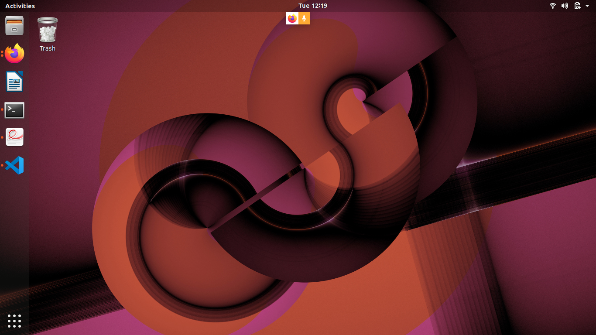
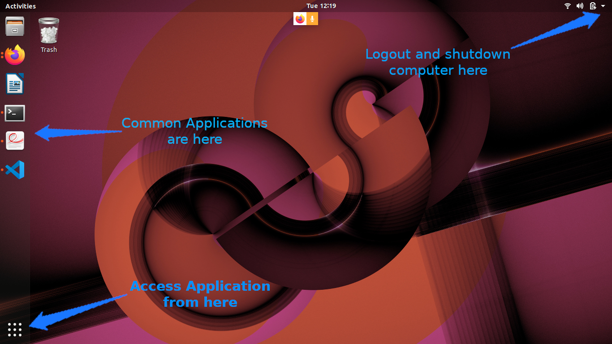
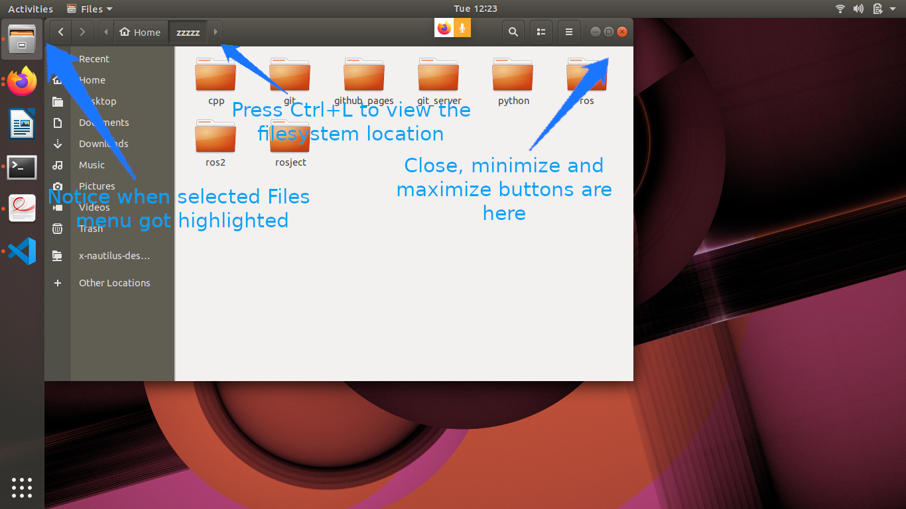
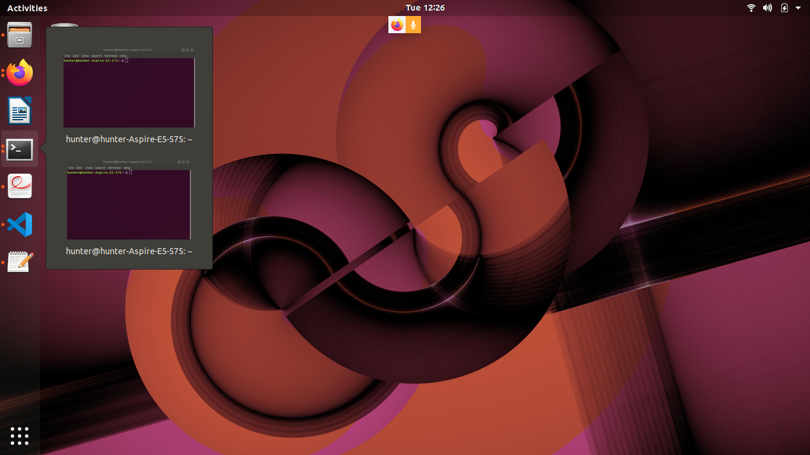
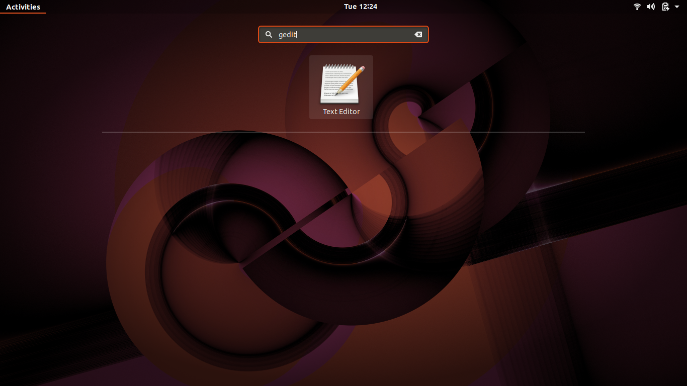
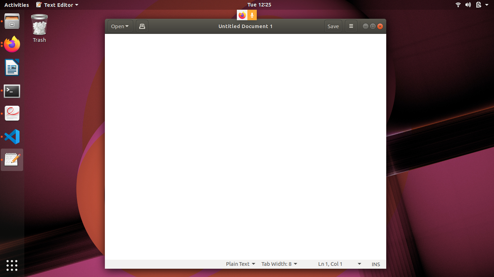

# Navigating the Ubuntu GUI
> In this exercise, we will familiarize ourselves with the graphical user interface (GUI) of the Ubuntu operating system.

## Task 0: Presentation Slides
Don't forget about the [presentation slides](../../_downloads/slides/ROS-I%20Basic%20Developers%20Training%20-%20Session%200.pdf) that accompany this Lesson!

## Task 1: Familiarize Yourself with the Ubuntu Desktop
At the log-in screen, click in the password input box, enter `rosindustrial` for the password, and hit enter. The screen should look like the image below when you log in:

There are several things you will notice on the desktop:

1. The gear icon on the top right of the screen brings up a menu which allows the user to log out, shut down the computer, access system settings, etc...
2. The bar on the left side shows running and "favorite" applications, connected thumb drives, etc.
3. The top icon is used to access all applications and files. We will look at this in more detail later.
 1. The next icons are either applications which are currently running or have been "pinned" (again, more on pinning later)
 3. Any removable drives, like thumb drives, are found after the application icons.
 4. If the launcher bar gets "too full", clicking and dragging up/down allows you to see the applications that are hidden.
 5. To reorganize the icons on the launcher, click and hold the icon until it "pops out", then move it to the desired location.

## Task 2: Open and Inspect an Application
Click on the filing-cabinet icon in the launcher. A window should show up, and your desktop should look like something below:

Things to notice:

1. The close, minimize, and maximize buttons typically found on the right-hand side of the window title bar are found on the left-hand side.
2. The menu for windows are found on the menu bar at the top of the screen, much in the same way Macs do. The menus, however, only show up when you hover the mouse over the menu bar.
3. Notice that there are menu highlights of the folder icon. The dots on the left show how many windows of this application are open. Clicking on these icons when the applications are open does one of two things:
 * If there is only one window open, this window gets focus.
 * If more than one are open, clicking a second time causes all of the windows to show up in the foreground, so that you can choose which window to go to (see below):

## Task 3: Start an Application & Pin it to the Launcher Bar
Click on the launcher button (top left) and type gedit in the search box. The "Text Editor" application (this is actually gedit) should show up (see below):

Click on the application. The text editor window should show up on the screen, and the text editor icon should show up on the launcher bar on the left-hand side (see below):

1. Right-click on the text editor launch icon, and select "Lock to Launcher".
2. Close the gedit window. The launcher icon should remain after the window closes.
3. Click on the gedit launcher icon. You should see a new gedit window appear.

