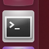

/# The Linux Terminal
> In this exercise, we will familiarize ourselves with the Linux terminal.

## Starting the Terminal

 1. To open the terminal, click on the terminal icon: 

    

 1. Create a second terminal window, either by:

    * Right-clicking on the terminal and selecting the "Open Terminal" or
    * Selecting "Open Terminal" from the "File" menu

 1. Create a second terminal within the same window by pressing "Ctrl+Shift+T" while the terminal window is selected.

 1. Close the 2nd terminal tab, either by:

    * clicking the small 'x' in the terminal tab (not the main terminal window)
    * typing `exit` and hitting enter.

 1. The window will have a single line, which looks like this:

    `ros-industrial@ros-i-melodic-vm:~$`

 1. This is called the prompt, where you enter commands. The prompt, by default, provides three pieces of information:

    1. _ros-industrial_ is the login name of the user you are running as.
    1. _ros-i-melodic-vm_ is the host name of the computer.
    1. ~ is the directory in which the terminal is currently in. (More on this later).

 1. Close the terminal window by typing `exit` or clicking on the red 'x' in the window's titlebar.

## Navigating Directories and Listing Files

### Prepare your environment ###
 1. Open your home folder in the file browser.
 1. Double-click on the `ex0.3` folder we created in the previous step.
    * _We'll use this to illustrate various file operations in the terminal._
 1. Right click in the main file-browser window and select "Open in Terminal" to create a terminal window at that location.
 1. In the terminal window, type the following command to create some sample files that we can study later:
    * `cp -a ~/industrial_training/exercises/0.3/. .`

### ls Command ###
 1. Enter `ls` into the terminal. 
    * You should see `test.txt`, and `new` listed. (If you don't see 'new', go back and complete the [previous exercise](Exploring-the-Linux-File-System.md)).
    * Directories, like `new`, are colored in blue.
    * The file `sample_job` is in green; this indicates it has its "execute" bit set, which means it can be executed as a command.  
 1. Type `ls *.txt`.  Only the file `test.txt` will be displayed.
 1. Enter `ls -l` into the terminal.
    * Adding the `-l` option shows one entry per line, with additional information about each entry in the directory.
    * The first 10 characters indicate the file type and permissions
    * The first character is `d` if the entry is a directory.
    * The next 9 characters are the permissions bits for the file
    * The third and fourth fields are the owning user and group, respectively.
    * The second-to-last field is the time the file was last modified.
    * If the file is a symbolic link, the link's target file is listed after the link's file name.
 1. Enter `ls -a` in the terminal.
    * You will now see one additional file, which is hidden.
 1. Enter `ls -a -l` (or `ls -al`) in the command.
    * You'll now see that the file `hidden_link.txt` points to `.hidden_text_file.txt`.

### `pwd` and `cd` Commands ###
 1. Enter `pwd` into the terminal.
    * This will show you the full path of the directory you are working in.
 1. Enter `cd new` into the terminal.
    * The prompt should change to `ros-industrial@ros-i-melodic-vm:~/ex0.3/new$`.
    * Typing `pwd` will show you now in the directory `/home/ros-industrial/ex0.3/new`.
  1. Enter `cd ..` into the terminal.
    * In the [previous exercise](Exploring-the-Linux-File-System.md), we noted that `..` is the parent folder.
    * The prompt should therefore indicate that the current working directory is `/home/ros-industrial/ex0.3`.
 1. Enter `cd /bin`, followed by `ls`.
    * This folder contains a list of the most basic Linux commands. 
    _Note that `pwd` and `ls` are both in this folder._
 1. Enter `cd ~/ex0.3` to return to our working directory.
    * Linux uses the `~` character as a shorthand representation for your home directory.
    * It's a convenient way to reference files and paths in command-line commands.
    * You'll be typing it a lot in this class... remember it!

_If you want a full list of options available for any of the commands given in this section, type `man <command>` (where `<command>` is the command you want information on) in the command line.  This will provide you with built-in documentation for the command.  Use the arrow and page up/down keys to scroll, and `q` to exit._

## Altering Files ##

### mv Command ###
 1. Type `mv test.txt test2.txt`, followed by `ls`.
    * You will notice that the file has been renamed to `test2.txt`. 
    _This step shows how `mv` can rename files._
 1. Type `mv test2.txt new`, then `ls`.
    * The file will no longer be present in the folder. 
 1. Type `cd new`, then `ls`.
    * You will see `test2.txt` in the folder. 
    _These steps show how `mv` can move files._
 1. Type `mv test2.txt ../test.txt`, then `ls`.
    * `test2.txt` will no longer be there.
 1. Type `cd ..`, then `ls`.
    * You will notice that `test.txt` is present again. 
    _This shows how `mv` can move and rename files in one step._

### cp Command ###
 1. Type `cp test.txt new/test2.txt`, then `ls new`.
    * You will see `test2.txt` is now in the `new` folder.
 1. Type `cp test.txt "test copy.txt"`, then `ls -l`.
    * You will see that `test.txt` has been copied to `test copy.txt`. 
    _Note that the quotation marks are necessary when spaces or other special characters are included in the file name._

### rm Command ###
 1. Type `rm "test copy.txt"`, then `ls -l`.
    * You will notice that `test copy.txt` is no longer there.

### mkdir Command ###
 1. Type `mkdir new2`, then `ls`.
    * You will see there is a new folder `new2`.

_You can use the  `-i` flag with `cp`, `mv`, and `rm` commands to prompt you when a file will be overwritten or removed._

## Job management ##
### Stopping Jobs ###
 1. Type `./sample_job`.
    * The program will start running.
 1. Press Control+C.
    * The program should exit.
 1. Type `./sample_job sigterm`.
    * The program will start running.
 1. Press Control+C.
    * This time the program will not die.

### Stopping "Out of Control" Jobs ###
 1. Open a new terminal window.
 1. Type `ps ax`.
 1. Scroll up until you find `python ./sample_job sigterm`.
    * This is the job that is running in the first window.
    * The first field in the table is the ID of the process (use `man ps` to learn more about the other fields).
 1. Type `ps ax | grep sample`.
    * You will notice that only a few lines are returned.
    * This is useful if you want to find a particular process
    * _Note: this is an advanced technique called "piping", where the output of one program is passed into the input of the next.  This is beyond the scope of this class, but is useful to learn if you intend to use the terminal extensively._
 1. Type `kill <id>`, where `<id>` is the job number you found with the `ps ax`.
 1. In the first window, type `./sample_job sigterm sigkill`.
    * The program will start running.
 1. In the second window, type `ps ax | grep sample` to get the id of the process.
 1. Type `kill <id>`.
    * This time, the process will not die.
 1. Type `kill -SIGKILL <id>`.
    * This time the process will exit.

### Showing Process and Memory usage ###
 1. In a terminal, type `top`.
    * A table will be shown, updated once per second, showing all of the processes on the system, as well as the overall CPU and memory usage.
 1. Press the Shift+P key.
    * This will sort processes by CPU utilization. 
    _This can be used to determine which processes are using too much CPU time._
 1. Press the Shift+M key.
    * This will sort processes by memory utilization 
    _This can be used to determine which processes are using too much memory._
 1. Press q or Ctrl+C to exit the program.

### Editing Text (and Other GUI Commands) ###
 1. Type `gedit test.txt`.
    * You will notice that a new text editor window will open, and `test.txt` will be loaded.
    * The terminal will not come back with a prompt until the window is closed.
 1. There are two ways around this limitation.  Try both...
 1. **Starting the program and immediately returning a prompt:**
    1. Type `gedit test.txt &`.
       * The `&` character tells the terminal to run this command in "the background", meaning the prompt will return immediately.
    1. Close the window, then type `ls`.
       * In addition to showing the files, the terminal will notify you that `gedit` has finished.
 1. **Moving an already running program into the background:**
    1. Type `gedit test.txt`.
       * The window should open, and the terminal should not have a prompt waiting.
    1. In the terminal window, press Ctrl+Z. 
       * The terminal will indicate that `gedit` has stopped, and a prompt will appear.
    1. Try to use the `gedit` window.
       * Because it is paused, the window will not run.
    1. Type `bg` in the terminal.
       * The `gedit` window can now run.
    1. Close the `gedit` window, and type `ls` in the terminal window.
       * As before, the terminal window will indicate that `gedit` is finished.

### Running Commands as Root ###
 1. In a terminal, type `ls -a /root`.
    * The terminal will indicate that you cannot read the folder `/root`.
    * Many times you will need to run a command that cannot be done as an ordinary user, and must be done as the "super user"
 1. To run the previous command as root, add `sudo` to the beginning of the command.
    * In this instance, type `sudo ls -a /root` instead.
    * The terminal will request your password (in this case, `rosindustrial`) in order to proceed.
    * Once you enter the password, you should see the contents of the `/root` directory.

_**Warning**: `sudo` is a powerful tool which doesn't provide any sanity checks on what you ask it to do, so be **VERY** careful in using it._
