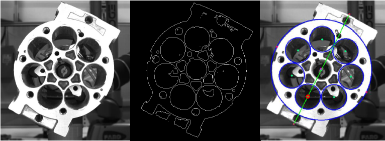

# OpenCV Image Processing (Python)
In this exercise, we will gain familiarity with both OpenCV and Python, through a simple 2D image-processing application.

## Motivation
OpenCV is a mature, stable library for 2D image processing, used in a wide variety of applications.  Much of ROS makes use of 3D sensors and point-cloud data, but there are still many applications that use traditional 2D cameras and image processing.

This tutorial uses python to build the image-processing pipeline.  Python is a good choice for this application, due to its ease of rapid prototyping and existing bindings to the OpenCV library.

## Further Information and Resources
* [OpenCV Website](https://opencv.org/)
* [OpenCV API](https://docs.opencv.org/3.0-beta/modules/refman.html)
* [OpenCV Python Tutorials](https://docs.opencv.org/3.4.2/d6/d00/tutorial_py_root.html)
* [ROS cv_bridge package (Python)](http://wiki.ros.org/cv_bridge/Tutorials/ConvertingBetweenROSImagesAndOpenCVImagesPython)
* [Writing a Publisher and Subscriber (Python)](http://wiki.ros.org/rospy_tutorials/Tutorials/WritingPublisherSubscriber)
* [sensor_msgs/Image](http://docs.ros.org/melodic/api/sensor_msgs/html/msg/Image.html)


## Problem Statement
In this exercise, you will create a new node to determine the angular pose of a pump housing using the OpenCV image processing library.  The pump's orientation is computed using a series of processing steps to extract and compare geometry features:

  1. Resize the image (to speed up processing)
  1. Threshold the image (convert to black & white)
  1. Locate the pump's outer housing (circle-finding)
  1. Locate the piston sleeve locations (blob detection)
  1. Estimate primary axis using bounding box
  1. Determine orientation using piston sleeve locations
  1. Calculate the axis orientation relative to a reference (horizontal) axis



## Implementation

### Create package
This exercise uses a single package that can be placed in any catkin workspace. The examples below will use the `~/catkin_ws` workspace from earlier exercises.

 1. Create a new `detect_pump` package to contain the new python nodes we'll be making:

    ```bash
    cd ~/catkin_ws/src
    catkin create pkg detect_pump --catkin-deps rospy cv_bridge
    ```
    * all ROS packages depend on `rospy`
    * we'll use `cv_bridge` to convert between ROS's standard Image message and OpenCV's Image object
    * `cv_bridge` also automatically brings in dependencies on the relevant OpenCV modules

 1. Create a python module for this package:

    ```bash
    cd detect_pump
    mkdir nodes
    ```

    * For a simple package such as this, the [Python Style Guide](http://docs.ros.org/melodic/api/catkin/html/howto/format2/installing_python.html) recommends this simplified package structure.
    * More complex packages (e.g. with exportable modules, msg/srv defintions, etc.) should us a more complex package structure, with an `__init__.py` and `setup.py`.
        * reference [Installing Python Scripts](http://docs.ros.org/melodic/api/catkin/html/howto/format2/installing_python.html)
        * reference [Handling setup.py](http://docs.ros.org/api/catkin/html/user_guide/setup_dot_py.html)

### Create an Image Publisher
The first node will read in an image from a file and publish it as a ROS [Image](http://docs.ros.org/melodic/api/sensor_msgs/html/msg/Image.html) message on the `image` topic.

 * Note: ROS already contains an `image_publisher` package/node that performs this function, but we will duplicate it here to learn about ROS Publishers in Python.

 1. Create a new python script for our image-publisher node (`nodes/image_pub.py`).  Fill in the following template for a skeleton ROS python node:

    ```python
    #!/usr/bin/env python
    import rospy

    def start_node():
        rospy.init_node('image_pub')
        rospy.loginfo('image_pub node started')

    if __name__ == '__main__':
        try:
            start_node()
        except rospy.ROSInterruptException:
            pass
    ```

 1. Allow execution of the new script file:

    ```bash
    chmod u+x nodes/image_pub.py
    ```

 1. Build the package and run the image publisher:

    ```bash
    catkin build
    roscore
    rosrun detect_pump image_pump.py
    ```

    * You should see the "node started" message

 1. Read the image file to publish, using the filename provided on the command line

    1. Import the `sys` and `cv2` (OpenCV) modules:

       ```python
       import sys
       import cv2
       ```

    1. Pass the command-line argument into the `start_node` function:

       ```python
       def start_node(filename):
       ...
       start_node( rospy.myargv(argv=sys.argv)[1] )
       ```
       * Note the use of `rospy.myargv()` to strip out any ROS-specific command-line arguments.

    1. In the `start_node` function, call the OpenCV [imread](https://docs.opencv.org/3.0-beta/modules/imgcodecs/doc/reading_and_writing_images.html#imread) function to read the image.  Then use [imshow](https://docs.opencv.org/3.0-beta/modules/highgui/doc/user_interface.html#imshow) to display it:

       ```python
       img = cv2.imread(filename)
       cv2.imshow("image", img)
       cv2.waitKey(2000)
       ```

    1. Run the node, with the specified image file:

       ```bash
       rosrun detect_pump image_pub.py ~/industrial_training/exercises/5.4/pump.jpg
       ```
       * You should see the image displayed
       * Comment out the `imshow`/`waitKey` lines, as we won't need those any more
       * Note that you don't need to run `catkin build` after editing the python file, since no compile step is needed.

 1. Convert the image from OpenCV Image object to ROS Image message:

    1. Import the `CvBridge` and `Image` (ROS message) modules:

       ```python
       from cv_bridge import CvBridge
       from sensor_msgs.msg import Image
       ```

    1. Add a call to the CvBridge [cv2_to_imgmsg](https://docs.ros.org/api/cv_bridge/html/python/) method:

       ```python
       bridge = CvBridge()
       imgMsg = bridge.cv2_to_imgmsg(img, "bgr8")
       ```

1. Create a ROS publisher to continually publish the Image message on the `image` topic.  Use a loop with a 1 Hz throttle to publish the message.

    ```python
    pub = rospy.Publisher('image', Image, queue_size=10)
    while not rospy.is_shutdown():
        pub.publish(imgMsg)
        rospy.Rate(1.0).sleep()  # 1 Hz
    ```

1. Run the node and inspect the newly-published image message
    1. Run the node (as before):

       ```bash
       rosrun detect_pump image_pub.py ~/industrial_training/exercises/5.4/pump.jpg
       ```

    1. Inspect the message topic using command-line tools:

       ```bash
       rostopic list
       rostopic hz /image
       rosnode info /image_pub
       ```

    1. Inspect the published image using the standalone [image_view](http://wiki.ros.org/image_view#image_view.2BAC8-diamondback.image_view) node

       ```bash
       rosrun image_view image_view
       ```

### Create the Detect_Pump Image-Processing Node
The next node will subscribe to the `image` topic and execute a series of processing steps to identify the pump's orientation relative to the horizontal image axis.

 1. As before, create a basic ROS python node (`detect_pump.py`) and set its executable permissions:

    ```python
    #!/usr/bin/env python
    import rospy

    # known pump geometry
    #  - units are pixels (of half-size image)
    PUMP_DIAMETER = 360
    PISTON_DIAMETER = 90
    PISTON_COUNT = 7

    def start_node():
        rospy.init_node('detect_pump')
        rospy.loginfo('detect_pump node started')

    if __name__ == '__main__':
        try:
            start_node()
        except rospy.ROSInterruptException:
            pass
    ```

    ```bash
    chmod u+x nodes/detect_pump.py
    ```

    * Note that we don't have to edit `CMakeLists` to create new build rules for each script, since python does not need to be compiled.

 1. Add a ROS subscriber to the `image` topic, to provide the source for images to process.

    1. Import the `Image` message header

       ```python
       from sensor_msgs.msg import Image
       ```

    1. Above the `start_node` function, create an empty callback (`process_image`) that will be called when a new Image message is received:

       ```python
       def process_image(msg):
           try:
              pass
           except Exception as err:
               print err
       ```
       * The try/except error handling will allow our code to continue running, even if there are errors during the processing pipeline.

    1. In the `start_node` function, create a ROS Subscriber object:
       * subscribe to the `image` topic, monitoring messages of type `Image`
       * register the callback function we defined above

       ```python
       rospy.Subscriber("image", Image, process_image)
       rospy.spin()
       ```

       * reference: [rospy.Subscriber](http://docs.ros.org/melodic/api/rospy/html/rospy.topics.Subscriber-class.html)
       * reference: [rospy.spin](http://docs.ros.org/melodic/api/rospy/html/rospy-module.html#spin)

    1. Run the new node and verify that it is subscribing to the topic as expected:

       ```bash
       rosrun detect_pump detect_pump.py
       rosnode info /detect_pump
       rqt_graph
       ```

 1. Convert the incoming `Image` message to an OpenCV `Image` object and display it
 As before, we'll use the `CvBridge` module to do the conversion.

    1. Import the `CvBridge` modules:

       ```python
       from cv_bridge import CvBridge
       ```

    1. In the `process_image` callback, add a call to the CvBridge [imgmsg_to_cv2](https://docs.ros.org/api/cv_bridge/html/python/) method:

       ```python
       # convert sensor_msgs/Image to OpenCV Image
       bridge = CvBridge()
       orig = bridge.imgmsg_to_cv2(msg, "bgr8")
       ```
       * This code (and all other image-processing code) should go inside the `try` block, to ensure that processing errors don't crash the node.
       * This should replace the placeholder `pass` command placed in the `try` block earlier

    1. Use the OpenCV `imshow` method to display the images received.  We'll create a pattern that can be re-used to show the result of each image-processing step.

       1. Import the OpenCV `cv2` module:

          ```python
          import cv2
          ```

       1. Add a display helper function above the `process_image` callback:

          ```python
          def showImage(img):
              cv2.imshow('image', img)
              cv2.waitKey(1)
          ```

       1. Copy the received image to a new "drawImg" variable:

          ```python
          drawImg = orig
          ```

       1. **Below** the `except` block (outside its scope; at `process_image` scope, display the `drawImg` variable:

          ```python
          # show results
          showImage(drawImg)
          ```

    1. Run the node and see the received image displayed.

 1. The first step in the image-processing pipeline is to resize the image, to speed up future processing steps.  Add the following code inside the `try` block, then rerun the node.

    ```python
    # resize image (half-size) for easier processing
    resized = cv2.resize(orig, None, fx=0.5, fy=0.5)
    drawImg = resized
    ```
    * you should see a smaller image being displayed
    * reference: [resize()](https://docs.opencv.org/3.0-beta/modules/imgproc/doc/geometric_transformations.html#resize)

 1. Next, convert the image from color to grayscale.  Run the node to check for errors, but the image will still look the same as previously.

    ```python
    # convert to single-channel image
    gray = cv2.cvtColor(resized, cv2.COLOR_BGR2GRAY)
    drawImg = cv2.cvtColor(gray, cv2.COLOR_GRAY2BGR)
    ```
    * Even though the original image looks gray, the JPG file, Image message, and `orig` OpenCV image are all 3-channel color images.
    * Many OpenCV functions operate on individual image channels.  Converting an image that appears gray to a "true" 1-channel grayscale image can help avoid confusion further on.
    * We convert back to a color image for `drawImg` so that we can draw colored overlays on top of the image to display the results of later processing steps.
    * reference: [cvtColor()](https://docs.opencv.org/3.0-beta/modules/imgproc/doc/miscellaneous_transformations.html#cvtcolor)

 1. Apply a thresholding operation to turn the grayscale image into a binary image.  Run the node and see the thresholded image.

    ```python
    # threshold grayscale to binary (black & white) image
    threshVal = 75
    ret,thresh = cv2.threshold(gray, threshVal, 255, cv2.THRESH_BINARY)
    drawImg = cv2.cvtColor(thresh, cv2.COLOR_GRAY2BGR)
    ```

    You should experiment with the `threshVal` paramter to find a value that works best for this image.  Valid values for this parameter lie between [0-255], to match the grayscale pixel intensity range.  Find a value that clearly highlights the pump face geometry.  I found that a value of `150` seemed good to me.

    * reference [threshold](https://docs.opencv.org/3.0-beta/modules/imgproc/doc/miscellaneous_transformations.html#threshold)

 1. Detect the outer pump-housing circle.

     This is not actually used to detect the pump angle, but serves as a good example of feature detection.  In a more complex scene, you could use OpenCV's Region Of Interest (ROI) feature to limit further processing to only features inside this pump housing circle.

    1. Use the `HoughCircles` method to detect a pump housing of known size:

       ```python
       # detect outer pump circle
       pumpRadiusRange = ( PUMP_DIAMETER/2-2, PUMP_DIAMETER/2+2)
       pumpCircles = cv2.HoughCircles(thresh, cv2.HOUGH_GRADIENT, 1, PUMP_DIAMETER, param2=2, minRadius=pumpRadiusRange[0], maxRadius=pumpRadiusRange[1])
       ```

       * reference: [HoughCircles](https://docs.opencv.org/3.0-beta/modules/imgproc/doc/feature_detection.html#houghcircles)

    1. Add a function to display all detected circles (above the `process_image` callback):

       ```python
       def plotCircles(img, circles, color):
           if circles is None: return

           for (x,y,r) in circles[0]:
               cv2.circle(img, (int(x),int(y)), int(r), color, 2)
       ```

    1. Below the circle-detect, call the display function and check for the expected # of circles (1)

       ```python
       plotCircles(drawImg, pumpCircles, (255,0,0))
       if (pumpCircles is None):
           raise Exception("No pump circles found!")
       elif len(pumpCircles[0])<>1:
           raise Exception("Wrong # of pump circles: found {} expected {}".format(len(pumpCircles[0]),1))
       else:
           pumpCircle = pumpCircles[0][0]
       ```

    1. Run the node and see the detected circles.

       * Experiment with adjusting the `param2` input to `HoughCircles` to find a value that seems to work well.  This parameter represents the sensitivity of the detector; lower values detect more circles, but also will return more false-positives.
       * Tru removing the `min/maxRadius` parameters or reducing the minimum distance between circles (4th parameter) to see what other circles are detected.
       * I found that a value of `param2=7` seemed to work well

 1. Detect the piston sleeves, using blob detection.

    Blob detection analyses the image to identify connected regions (blobs) of similar color.  Filtering of the resulting blob features on size, shape, or other characteristics can help identify features of interest.  We will be using OpenCV's [SimpleBlobDetector](https://docs.opencv.org/3.2.0/d0/d7a/classcv_1_1SimpleBlobDetector.html).

    1. Add the following code to run blob detection on the binary image:

       ```python
       # detect blobs inside pump body
       pistonArea = 3.14159 * PISTON_DIAMETER**2 / 4
       blobParams = cv2.SimpleBlobDetector_Params()
       blobParams.filterByArea = True
       blobParams.minArea = 0.80 * pistonArea
       blobParams.maxArea = 1.20 * pistonArea
       blobDetector = cv2.SimpleBlobDetector_create(blobParams)
       blobs = blobDetector.detect(thresh)
       ```
       * Note the use of an Area filter to select blobs within 20% of the expected piston-sleeve area.
       * By default, the blob detector is configured to detect black blobs on a white background. so no additional color filtering is required.

    1. Below the blob detection, call the OpenCV blob display function and check for the expected # of piston sleeves (7):

       ```python
       drawImg = cv2.drawKeypoints(drawImg, blobs, (), (0,255,0), cv2.DRAW_MATCHES_FLAGS_DRAW_RICH_KEYPOINTS)
       if len(blobs) <> PISTON_COUNT:
           raise Exception("Wring # of pistons: found {} expected {}".format(len(blobs), PISTON_COUNT))
       pistonCenters = [(int(b.pt[0]),int(b.pt[1])) for b in blobs]
       ```

    1. Run the node and see if all piston sleeves were properly identified

 1. Detect the primary axis of the pump body.

    This axis is used to identify the key piston sleeve feature.  We'll reduce the image to contours (outlines), then find the largest one, fit a rectangular box (rotated for best-fit), and identify the major axis of that box.

    1. Calculate image contours and select the one with the largest area:

       ```python
       # determine primary axis, using largest contour
       im2, contours, h = cv2.findContours(thresh, cv2.RETR_TREE, cv2.CHAIN_APPROX_SIMPLE)
       maxC = max(contours, key=lambda c: cv2.contourArea(c))
       ```

    1. Fit a bounding box to the largest contour:

       ```python
       boundRect = cv2.minAreaRect(maxC)
       ```

    1. Copy these 3 helper functions to calculate the endpoints of the rectangle's major axis (above the `process_image` callback):

       ```python
       import math
       ...

       def ptDist(p1, p2):
           dx=p2[0]-p1[0]; dy=p2[1]-p1[1]
           return math.sqrt( dx*dx + dy*dy )

       def ptMean(p1, p2):
           return ((int(p1[0]+p2[0])/2, int(p1[1]+p2[1])/2))

       def rect2centerline(rect):
           p0=rect[0]; p1=rect[1]; p2=rect[2]; p3=rect[3];
           width=ptDist(p0,p1); height=ptDist(p1,p2);

           # centerline lies along longest median
           if (height > width):
               cl = ( ptMean(p0,p1), ptMean(p2,p3) )
           else:
               cl = ( ptMean(p1,p2), ptMean(p3,p0) )

           return cl
       ```

    1. Call the `rect2centerline` function from above, with the bounding rectangle calculated earlier.  Draw the centerline on top of our display image.

       ```python
       centerline = rect2centerline(cv2.boxPoints(boundRect))
       cv2.line(drawImg, centerline[0], centerline[1], (0,0,255))
       ```

 1. The final step is to identify the key piston sleeve (closest to centerline) and use position to calculate the pump angle.

    1. Add a helper function to calculate the distance between a point and the centerline:

       ```python
       def ptLineDist(pt, line):
           x0=pt[0]; x1=line[0][0]; x2=line[1][0];
           y0=pt[1]; y1=line[0][1]; y2=line[1][1];
           return abs((x2-x1)*(y1-y0)-(x1-x0)*(y2-y1))/(math.sqrt((x2-x1)*(x2-x1)+(y2-y1)*(y2-y1)))
       ```

    1. Call the `ptLineDist` function to find which piston blob is closest to the centerline.  Update the drawImg to show which blob was identified.

       ```python
       # find closest piston to primary axis
       closestPiston = min( pistonCenters, key=lambda ctr: ptLineDist(ctr, centerline))
       cv2.circle(drawImg, closestPiston, 5, (255,255,0), -1)
       ```

    1. Calculate the angle between the 3 key points: piston sleeve centerpoint, pump center, and an arbitrary point along the horizontal axis (our reference "zero" position).

        1. Add a helper function `findAngle` to calculate the angle between 3 points:

           ```python
           import numpy as np

           def findAngle(p1, p2, p3):
               p1=np.array(p1); p2=np.array(p2); p3=np.array(p3);
               v1=p1-p2; v2=p3-p2;
               return math.atan2(-v1[0]*v2[1]+v1[1]*v2[0],v1[0]*v2[0]+v1[1]*v2[1]) * 180/3.14159
           ```

        1. Call the `findAngle` function with the appropriate 3 keypoints:

           ```python
           # calculate pump angle
           p1 = (orig.shape[1], pumpCircle[1])
           p2 = (pumpCircle[0], pumpCircle[1])
           p3 = (closestPiston[0], closestPiston[1])
           angle = findAngle(p1, p2, p3)
           print "Found pump angle: {}".format(angle)
           ```

 1. You're done!  Run the node as before.  The reported pump angle should be near 24 degrees.

### Challenge Exercises
For a greater challenge, try the following suggestions to modify the operation of this image-processing example:

 1. Modify the `image_pub` node to rotate the image by 10 degrees between each publishing step.  The following code can be used to rotate an image:

    ```python
    def rotateImg(img, angle):
        rows,cols,ch = img.shape
        M = cv2.getRotationMatrix2D((cols/2,rows/2),angle,1)
        return cv2.warpAffine(img,M,(cols,rows))
    ```

 1. Change the `detect_pump` node to provide a **service** that performs the image detection.  Define a custom service type that takes an input image and outputs the pump angle.  Create a new application node that subscribes to the `image` topic and calls the `detect_pump` service.

 1. Try using `HoughCircles` instead of `BlobDetector` to locate the piston sleeves.
