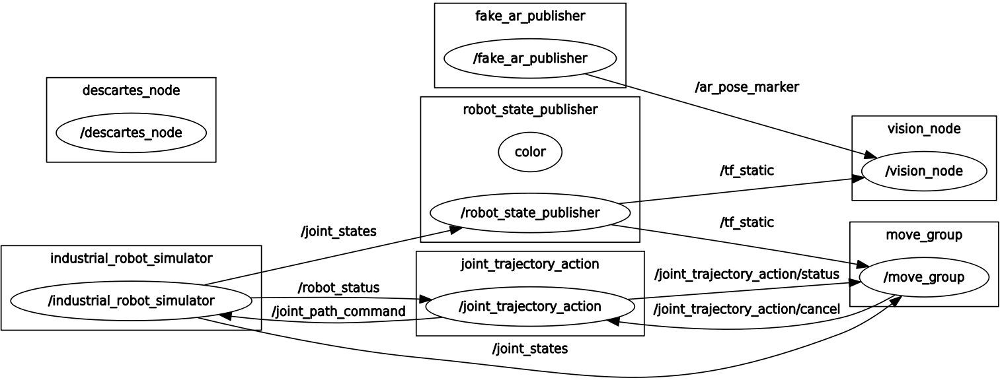
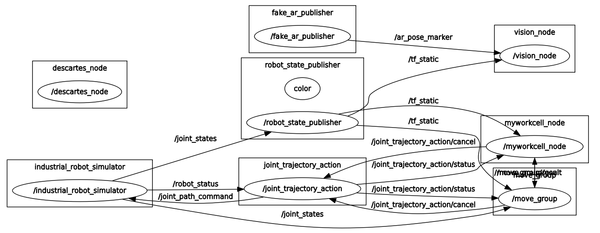
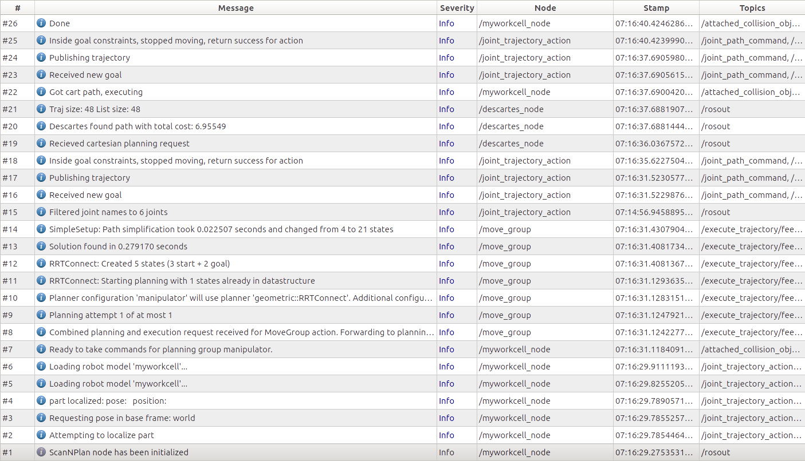
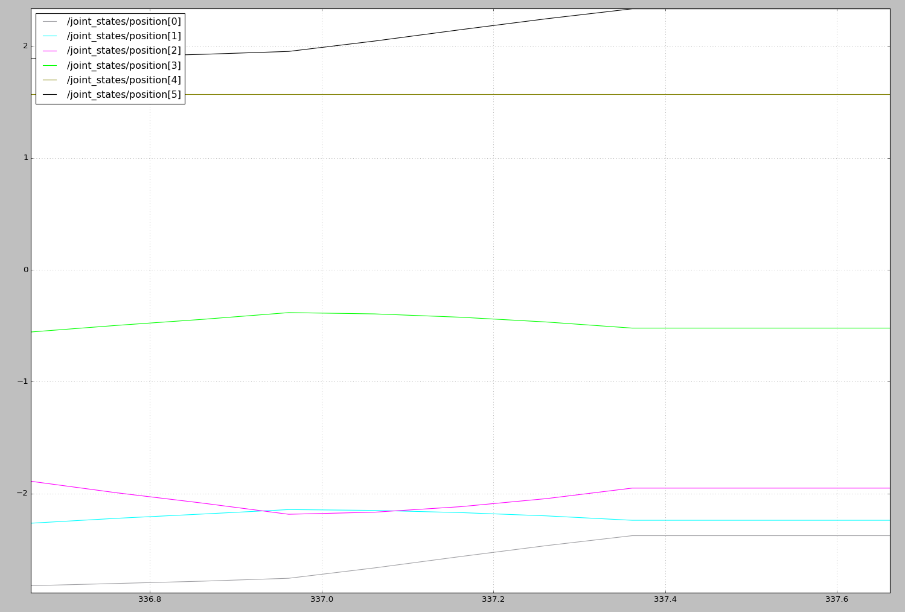

# Using rqt Tools for Analysis
> In this exercise we will use rqt_console, rqt_graph and urdf_to_graphviz to understand behavior of the ROS system. 

## Motivation
When complicated multi-node ros systems are running it can be important to understand the interactions of nodes.  

## Information and Resources
[Using a catkin workspace](http://wiki.ros.org/catkin/Tutorials/using_a_workspace)

## Problem Statement
The Scan-N-Plan application is complete.  We would like to further inspect the application using the various ROS rqt tools.

## Guidance
### `rqt_graph`: view node interaction
In complex applications, it may be helpful to get a visual representation of the ROS node interactions.
1. Launch the Scan-N-Plan workcell:
```
roslaunch myworkcell_support setup.launch 
```
2. In a 2nd terminal, launch the rqt_graph:
```
rqt_graph
```
3. Here we can see the basic layout of our Scan-N-Plan application:

4. In a 3rd terminal, launch the descartes path planner.:
```
rosrun myworkcell_core myworkcell_node
```
5. You must update the graph while the node is running because the graph will not update automatically.  After the update, we see our updated ROS network contains out myworkcell_node. Also, The myworkcell_node is publishing a new topic `/move_group/goal` which is subscribed by the move_group node. 


### `rqt_console`: view messages:
Now, we would like to see the output of the path planner.  rqt_console is a great gui for viewing ROS topics.
1. Kill the rqt_graph application in the 2nd terminal and run rqt_console:
```
rqt_console
```
2. Run the path planner:
```
rosrun myworkcell_core myworkcell_node
```
3. The rqt_console automatically updates, showing the logic behind the path planner:


### `rqt_plot`: view data plots
rqt_plot is an easy way to plot ROS data in real time.  In this example, we will plot robot joint velocities from our path plan.
1. Kill the rqt_console application in the 2nd terminal and run rqt_plot:
```
rqt_plot
```
2. In the `Topic` field add the following topics:
```
/joint_states/position[0]
/joint_states/position[1]
/joint_states/position[2]
/joint_states/position[3]
/joint_states/position[4]
/joint_states/position[5]
```
3. Then run the path planner:
```
rosrun myworkcell_core myworkcell_node
```
4. We can see the joint positions streaming in real-time:


