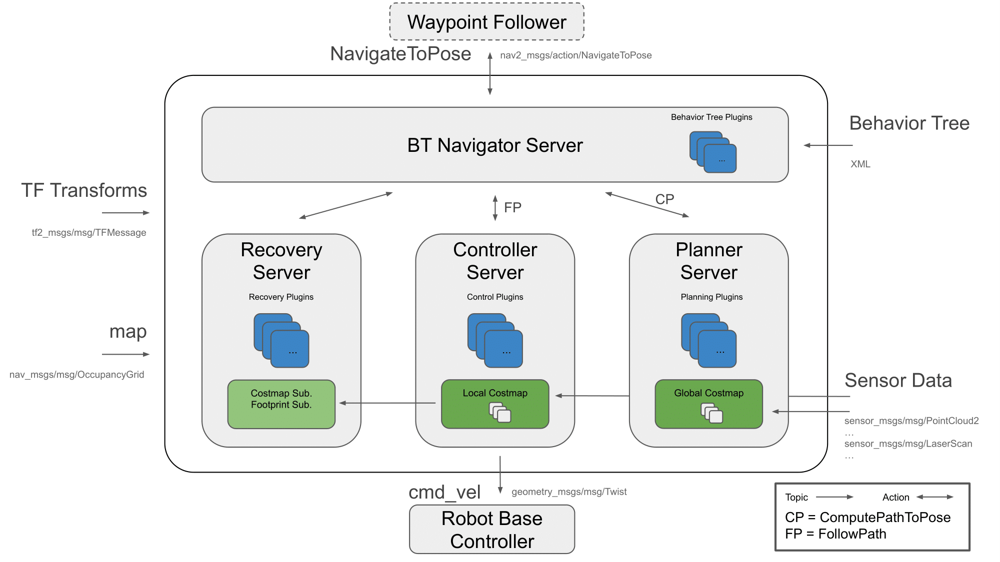

# ROS2 Navigation


## 1. Introduction
- The goal of this tutorial is  
    - to use the ROS2 navigation capabilities to move the robot autonomously.
- The packages you will use:
    - workshop_ros2_navigation

Lines beginning with `#` indicates the syntax of these commands.

Commands are executed in a terminal:

* Open a new terminal → use the shortcut ctrl+alt+t.
* Open a new tab inside an existing terminal → use the shortcut ctrl+shift+t.
* Lines beginning with `$` indicates the syntax of these commands.
* The computer of the real robot will be accessed from your local computer remotely. For every further command, a tag will inform which computer has to be used. It can be either `[TurtleBot]` or `[Remote PC]`.

You can use the given links for further information.


## 2. General approach

The ROS 2 Navigation System is the control system that enables a robot to autonomously reach a goal state, such as a specific position and orientation relative to a specific map. Given a current pose, a map, and a goal, such as a destination pose, the navigation system generates a plan to reach the goal, and outputs commands to autonomously drive the robot, respecting any safety constraints and avoiding obstacles encountered along the way.

It consists of several ROS components. An overview of its interactions is depicted in the following picture:




Figure 1: Navigation2 Architecture

source: [navigataion](https://navigation.ros.org/_images/architectural_diagram.png)


## 3. Temporary load the Map 
* Use the map generated during the cartographer tutorial.
 
 **A. Once your map is saved, check:** 

 **1.** all processes on your robot are shutdown.
 
 You can check it using:
 
  ```bash
  $ ros2 node list
  ```
  The output should be empty, otherwise, there are still running processes.

**2.** The location of the **map.yaml** and **map.pgm**.

For example, the workspace has the following layout:
```bash
nav_ws/
  maps/
    map.yaml
    map.pgm
    map_server_params.yaml
  src/
  build/
  install/
  log/
```

**B. Create a parameter file for map_server**

  `[Remote PC]`
  ```bash
  $ cd your_workspace
  $ touch map_server_params.yaml
  $ nano map_server_params.yaml
  ```

  ```yaml
  # map_server_params.yaml
  map_server:
      ros__parameters:
          frame_id: map
          topic_name: map
          use_sim_time: false
          yaml_filename: maps/map.yaml
  ```
  **Hint**: 
  * make sure there is right path of *map.pgm* in *map.yaml*. The path of map.png in map.yaml is relative. So if "map.yaml" and "map.png" are in the same folder, the parameter of "image:" should be "image: map.pgm"
  * in "map_server_params.yaml", the path of "yaml_filename" is also relative.  So if "map_server_params.yaml" and "map.yaml" are in the same folder, the parameter of "image:" should be "yaml_filename: map.yaml". 
    
  **C. Start map_server**

  `[Remote PC]`

    ```bash
    $ ros2 run nav2_map_server map_server --ros-args \ --params-file maps/map_server_params.yaml"
    ```
  **map_server** is  a lifecycle node and needs to be transitioned to the active state.
    
  In other terminal:
  Run this command to check that state transition.    

  `[Remote PC]`
  ```bash
  $ ros2 lifecycle list /map_server
  ```
  Run this command to trigger **map_server**. 
  ```bash
  $ ros2 lifecycle set /map_server 1
  ``` 
    

  **D. Start **rviz2** to view the map**
  Start a new terminal, source ros foxy workspace:
  ```bash
  $ rviz2
  ```
  In rviz2, choose "add", "by topic" and "/map"

  In other terminal, active **map_server**:
  ```bash
  $ ros2 lifecycle set /map_server 3
  ```

  Then you can see the map in rviz2


<!-- pagebreak  -->

## 4. Launch the navigation stack

Start either the simulated robot or the real robot!

Before starting, you need check that you already terminate the process of rviz2 and map_server.

### 4.1 Start the simulated robot

* a. Open a terminal

* b. Set key environment variables

    First you need to go into your workspace and source your workspace:
    ```bash
    $ source install/setup.bash
    ```
    Set up Gazebo model path:
    ```bash
    $ export GAZEBO_MODEL_PATH=`ros2 pkg \
    prefix turtlebot3_gazebo`/share/turtlebot3_gazebo/models/
    ```
    set up the robot model that you will use:
    ```bash
    $ export TURTLEBOT3_MODEL=burger
    ```
    Here we use "11" as ROS Domain ID:
    ```bash
    $ export ROS_DOMAIN_ID=11
    ```
* c. Bring up Turtlebot in simulation
    in the same terminal, run
    ```bash
    $ ros2 launch turtlebot3_gazebo turtlebot3_world.launch.py
    ```
  d. Start navigation stack
    open another terminal, source your workspace, set up the robot model that you will use, then 
    ```bash
    $ ros2 launch turtlebot3_navigation2 \
    navigation2.launch.py \
    use_sim_time:=true map:=maps/map.yaml
    ```
    The path of the map is relative to the place where you will run this command.

    You also can use this command to check which parameter that you can define:
    ```bash
    ros2 launch turtlebot3_navigation2 navigation2.launch.py \
    --show-args
    ```

    If everything has started correctly, you will see the RViz and Gazebo GUIs like this.
    

    
 


### 4.2 Start the real robot
***First try on simulation and finish next chapter then try it on real robot.***


<!-- Before start use navigation, make sure you have `workshop_ros2_navigation` in your source folder in `/src` in your workspace. 
 -->

Open a terminal on TurtleBot3.

Bring up basic packages to start TurtleBot3 applications.

`[TurtleBot3]`
```bash
$ source .bashrc
$ ros2 launch turtlebot3_bringup robot.launch.py
```

`[Remote PC]`
```bash
$ cd "your workspace"
$ source install/setup.bash
$ export ROS_DOMAIN_ID =
 "same as ROS DOMAIN ID of the turtlebot you are using"
$ ros2 launch turtlebot3_navigation2 navigation2.launch.py\
 map:=maps/map.yaml
```


## 5. Navigate the robot via rviz
* **Step 1: Tell the robot where it is** 
  
    after starting, the robot initially has no idea where it is. By default, Navigation 2 waits for you to give it an approximate starting position.

    It has to manually update the initial location and orientation of the TurtleBot3. This information is applied to the AMCL algorithm.

    This can be done graphically with RViz by the instruction below:
    

    
    * Click "2D Pose Estimate" button (in the top menu; see the picture)

    * Click on the approximate point in the map where the TurtleBot3 is located and drag the cursor to indicate the direction where TurtleBot3 faces.

    If you don’t get the location exactly right, that’s fine. Navigation 2 will refine the position as it navigates. You can also, click the “2D Pose Estimate” button and try again, if you prefer.

    Once you’ve set the initial pose, the tf tree will be complete and Navigation 2 is fully active and ready to go.

    If you are using simulation with turtlrbot_world map, it will show as below:
    
  

    As soon as the 2D Pose Estimation arrow is drawn, the pose (transformation from the map to the robot) will update. As a result the centre of the laser scan has changed, too. Check if the visualization of the live laser scan matches the contours
    of the virtual map (Illustrated in the following two pictures! The left one is the wrong robot pose and the right one is right robot pose) to confirm that the new starting pose is accurate.

        
    
    

    
  

* **Step 2: Give a goal**  

  if the TurtleBot3 is localized, it can automatically create a path from the current position to any target reachable position on the map. In order to set a goal position, follow the instruction below:
    * Click the 2D Nav Goal button (also in the top menu)
    * Click on a specific point in the map to set a goal position and drag the cursor to the direction where TurtleBot should be facing at the end
    
    ***Hint: If you wish to stop the robot before it reaches to the goal position, set the current position of TurtleBot3 as a goal position.***

    The swarm of the green small arrows is the visualization of the **adaptive Monte Carlo localization (AMCL)**. Every green arrow stands for a possible position and orientation of the TurtleBot3. Notice that in the beginning its distribution is spread over the whole map. As soon as the robot moves the arrows get updated because the algorithm incorporates new measurements. During the movement the distribution of arrows becomes less chaotic and settles more and more to the robot’s location, which finally means that the algorithm becomes more and more certain about the pose of the robot in the map.
  
 * **Step 3: Play around**    
  When the robot is on the way to the goal, you can put an obstacle in Gazebo:
    

    You can see how the robot reacts to this kind of situation:
   

    It depends on how you design the behavior tree structure. The one we are using is "navigate_w_replanning_and_recovery.xml" You can find in this [link](https://github.com/ros-planning/navigation2/blob/foxy-devel/nav2_bt_navigator/behavior_trees/navigate_w_replanning_and_recovery.xml)

