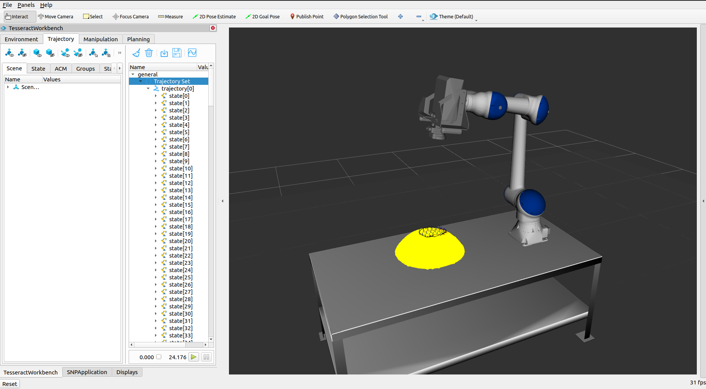
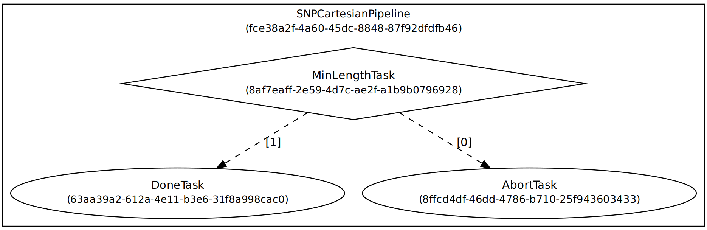
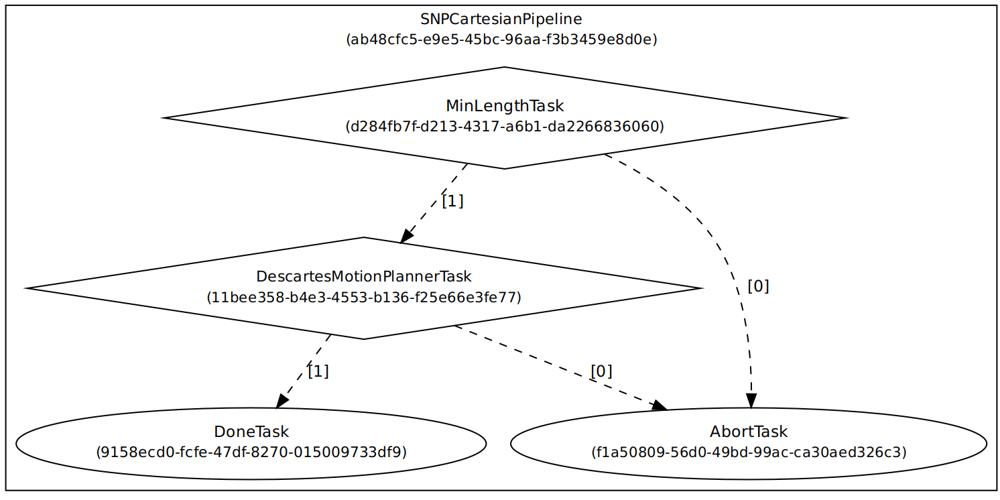
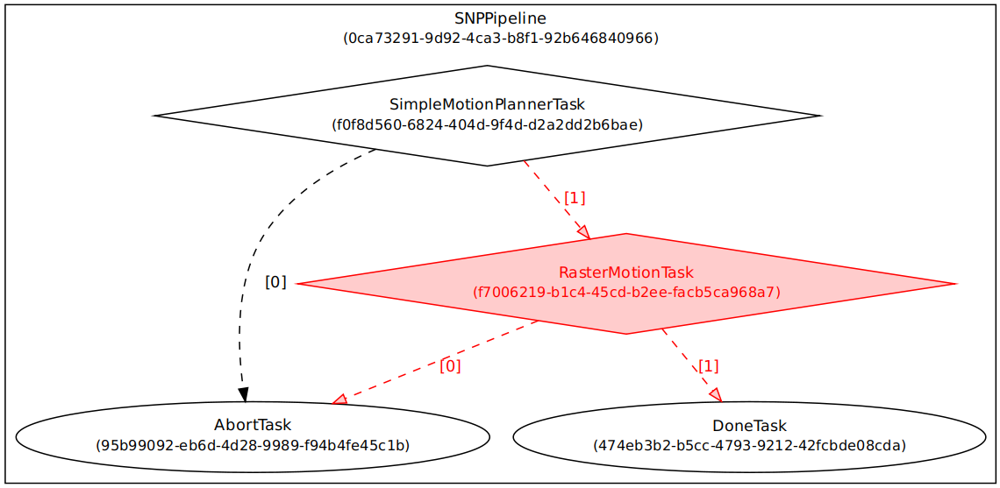
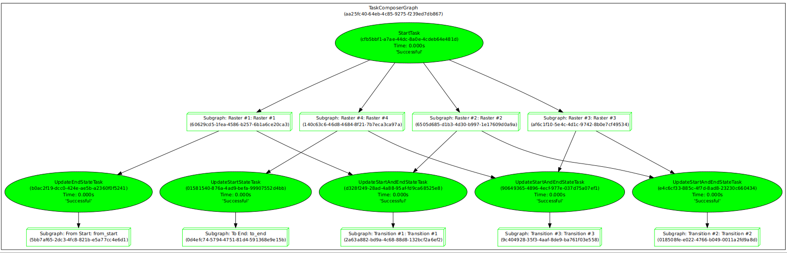
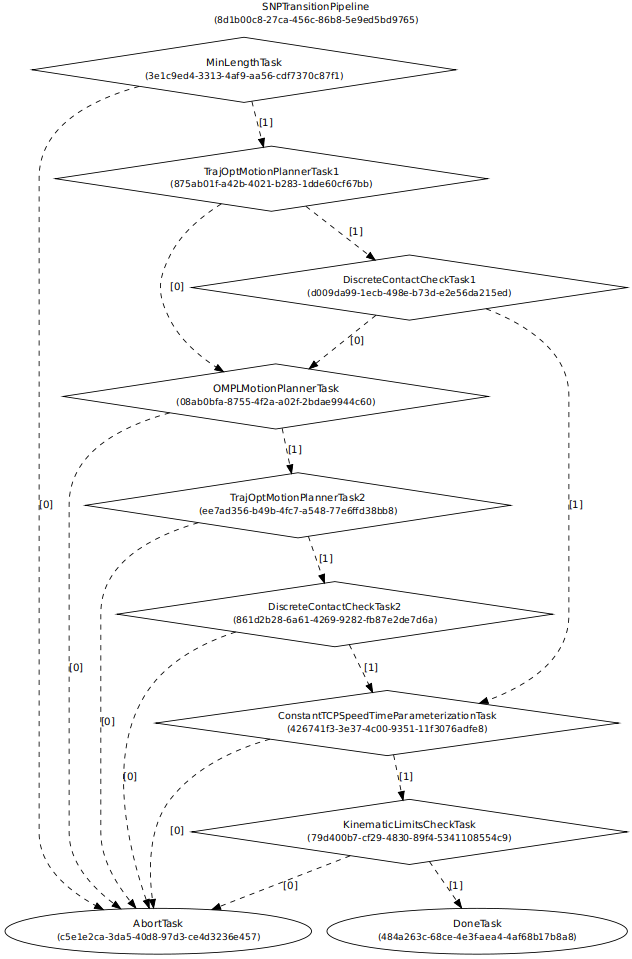

Motion Planning with Tesseract
==============================
In this exercise we will fill in the appropriate pieces of code to create a motion planning pipeline using Tesseract. The end goal of this will be to implement a "scan and plan" application. Much of the code from the exercise is from our `Scan N Plan Workshop <https://github.com/ros-industrial-consortium/scan_n_plan_workshop>`_.

Prepare New Workspace:
----------------------
We will create a new workspace, since this exercise does not overlap with the previous exercises.

#. Disable automatic sourcing of your previous workspace in your ``.bashrc`` if you had any.

    .. Note:: This means you'll need to manually source the setup file from your new colcon workspace in each new terminal window.

#. Source ROS 2 into your environment

    .. code-block:: bash

		source /opt/ros/foxy/setup.bash

    .. Note:: If you are using a VM provided by us, please skip to step 7 as a directory called ``tesseract_ws`` should already exist with the dependencies already installed for you.

#. Copy the template workspace layout and files:

	.. code-block:: bash

		mkdir -p ~/tesseract_ws/src
		cp -r ~/industrial_training/exercises/8.0/template/. ~/tesseract_ws/src
		cd ~/tesseract_ws/

#. Install ``taskflow`` from the ROS-I PPA

	.. code-block:: bash

		sudo add-apt-repository ppa:ros-industrial/ppa
		sudo apt-get update
		sudo apt-get install taskflow

#. Install the ROS 2 dependencies (this may take a while)

	.. code-block:: bash

		cd ~/tesseract_ws
		vcs import src < src/dependencies_tesseract.repos
		vcs import src < src/dependencies.repos
		vcs import src < src/snp_automate_2022/dependencies.repos
		rosdep install --from-paths src --ignore-src -r -y

#. Initialize and Build this new workspace (this may take a little while)

    	.. code-block:: bash

		cd ~/tesseract_ws
		colcon build --symlink-install --cmake-args -DTESSERACT_BUILD_FCL=OFF

#. Source the workspace

    	.. code-block:: bash

    		source ~/tesseract_ws/install/setup.bash

#. Import the new workspace into your QTCreator IDE (if using QTCreator):

   * In QTCreator: `File -> New File or Project -> Other Project -> ROS Workspace -> ~/tesseract_ws`
   * Don't forget to check the ROS distro and the build system!

Intro (Review Existing Code)
----------------------------
Most of the infrastructure for a ROS node has already been completed for you; the focus of this exercise are Tesseract custom pipelines and planner profiles. You will notice that many files and packages are already provided for you. You could run the application as is, but it won't do anything intelligent and you may notice some weird behaviors. At this time we will explore the source code that has been provided. The following are highlights of what is included.

#. ``snp_automate_2022/config/worcell_plugins.yaml``:
	* This file contains all of the kinematic plugins and contact manager plugins for our application. A kinematic plugin configuration file like this is required to use Tesseract. Take a look at ``workcell.srdf`` to see how it gets incorporated into the project.

#. ``snp_motion_planning/config/task_composer_plugins.yaml``:
   * This file contains the custom pipeline we will be using in this exercise. Currently, it is populated with very minimal pipelines. We will be modifying this file heavily to create increasingly complex and capable pipelines that enable solving difficult motion plans.

#. ``snp_motion_planning/src/planner_profiles.hpp``:
	* This file contains the planner profiles used to create our motion plan. The configuration of these profiles affect the behavior of the steps in our pipelines. Currently, only the Simple Planner profile is fully populated. This is one of the main files we will be editing in our exercise.

#. ``snp_motion_planning/src/planning_server.cpp``:
	* This is where our custom planner profiles will be used by our application. Take a look at the ``createProgram()`` method. This method takes in the toolpath rasters and constructs motion plan requests in a manner usable by Tesseract. These motions include freespace motions, transition motions, and raster (process) motions. The order that they are added is the same order that they will be returned in.

Running the Application
-----------------------
Throughout this exercise we will always follow the same process for running the application.

#. Launch the application with verbose logging on to help with debugging:
   .. code-block:: bash

         ros2 launch snp_automate_2022 start.launch.xml

   At this point you should see an RVIZ window pop up with an HC10 robot on a table

#. There should also be a `joint_state_publisher_gui` on your screen. Feel free to play around with it as well to create different start states.

#. Click the ``Get Detailed Scan`` button to populate the mesh we will be running process motions on

#. Click the ``Polygon Selection Tool`` on the top row of RVIZ

#. With your mouse draw a region on the yellow mesh where you want to process. 
   
   .. Note:: If this area is too small waypoints won't be able to be generated. Also, you can clear your drawing with a press of the middle mouse button.

#. Click back on the ``Interact``  button on the top row of RVIZ to go back to normal RVIZ interaction.

#. Click ``Generate Tool Path Plan`` to create waypoints. If no waypoints show up or you dislike your selected region try redrawing your area with the ``Polygon Selection Tool``

#. Once satisfied with your waypoints click ``Generate Motion Plan``. At this point your terminal should start writing out many lines.

#. Once motion planning is complete, if it is successful, you can see it by going to the ``TesseractWorkbench`` tab in the bottom left of RVIZ then the ``Trajectory`` tab and expose the items under ``general`` by clicking the arrow. Clicking on ``Trajectory Set`` will allow you to plan the planned trajectory and further inspection allows you to look at each individual step in detail.

#. To understand what exactly the pipeline did you can go to the ``/tmp`` directory and open the following files:
   * ScanNPlanPipeline.dot
   * SNPFreespacePipeline.dot
   * SNPTransitionPipeline.dot
   * SNPCartesianPipeline.dot
   * ScanNPlanPipelineResults.dot

Fill in the Code
----------------
If you try and run the application right now you'll get a successful plan, but right now it is just interpolated between waypoints naively. If you open the file ``/tmp/SNPCartesianPipeline.dot`` you'll see that only one step was performed and it was just checking that the raster meets a minimum length. 

.. Note:: In this graph a ``1`` signifies success and a ``0`` signifies failure.

Let's improve this pipeline by making it use Descartes when planning the Cartesian process motions.

Add Descartes to the Pipeline
^^^^^^^^^^^^^^^^^^^^^^^^^^^^^

Open the ``snp_motion_planning/config/task_composer_plugins.yaml`` file so we can add Descartes to the pipeline. Scroll down until you find the line that says ``SNPCartesianPipeline``. This is the place where the pipeline resides that made that dotgraph you just looked at. If you look at the ``nodes`` field you'll see exactly the nodes you see in the dotgraph.

.. code-block:: yaml

      nodes:
         DoneTask:
           class: DoneTaskFactory
           config:
             conditional: false
         AbortTask:
           class: AbortTaskFactory
           config:
             conditional: false
         MinLengthTask:
           class: MinLengthTaskFactory
           config:
             conditional: true
             inputs: [input_data]
             outputs: [output_data]

And how all of these nodes should be connected is defined in the ``edges`` part.

.. code-block:: yaml

      edges:
         - source: MinLengthTask
           destinations: [AbortTask, DoneTask]

We want to add a node that is called ``DescartesMotionPlannerTask`` of class ``DescartesFMotionPlannerTaskFactory``. Everything else should look like the ``MinLengthTask`` block, except we will add one additional required field ``format_result_as_input`` under ``config``, which will be set to ``false`` and for  ``inputs:`` we're going to put ``[output_data]`` because we want the input of Descartes to take the output of the previous task. From here on all our ``inputs`` and ``outputs`` will just be ``[output_data]``. The new nodes structure should look like this:

.. code-block:: yaml

      nodes:
         DoneTask:
           class: DoneTaskFactory
           config:
             conditional: false
         AbortTask:
           class: AbortTaskFactory
           config:
             conditional: false
         MinLengthTask:
           class: MinLengthTaskFactory
           config:
             conditional: true
             inputs: [input_data]
             outputs: [output_data]
         DescartesMotionPlannerTask:
           class: DescartesFMotionPlannerTaskFactory
           config:
             conditional: true
             inputs: [output_data]
             outputs: [output_data]
             format_result_as_input: false

Once you've updated the nodes you need to update the edges. to account for this new task. The edges should look like this:

.. code-block:: yaml

      edges:
         - source: MinLengthTask
           destinations: [AbortTask, DescartesMotionPlannerTask]
         - source: DescartesMotionPlannerTask
           destinations: [AbortTask, DoneTask]

.. Note:: In YAML files whitespace matters, so be very careful when adding to this document as it is easy to make mistakes if tabs don't perfectly align.

Now save this file and trying runnining a motion plan again! 

.. Note:: If you built with ``--symlink-install`` you don't need to rebuild, but if not you need to rebuild your workspace every time you make a change to this file

You should notice a difference in the planned motion with slightly more consistent joint motions with a given raster and if you look at ``/tmp/SNPCartesianPipeline.dot`` you should see this:

Now the process motions look better, but the freespaces and transitions are still just doing joint interpolation. Let's fix that by incorporating OMPL.

Add OMPL to the Pipeline
^^^^^^^^^^^^^^^^^^^^^^^^

Just like we added Descartes to ``SNPCartesianPipeline`` we will add OMPL to ``SNPFreespacePipeline`` and ``SNPTransitionPipeline``. We're going to call this task ``OMPLMotionPlannerTask`` and it will be of class ``OMPLMotionPlannerTaskFactory``.

.. Note:: You can name the tasks whatever you want we just chose ``OMPLMotionPlannerTask`` because it is clear. Make sure your task name matches what you put in ``edges``. However, the class name must strictly match the generated plugins.

By following the same process as Descartes go ahead and try to add OMPL to your Freespace and Transition pipelines.

.. raw:: html

   

   
Add OMPL to Pipelines Solution Spoiler

   <pre>
   <code>
   SNPFreespacePipeline:
     class: GraphTaskFactory
     config:
       inputs: [input_data]
       outputs: [output_data]
       nodes:
         DoneTask:
           class: DoneTaskFactory
           config:
             conditional: false
         AbortTask:
           class: AbortTaskFactory
           config:
             conditional: false
         MinLengthTask:
           class: MinLengthTaskFactory
           config:
             conditional: true
             inputs: [input_data]
             outputs: [output_data]
         OMPLMotionPlannerTask:
           class: OMPLMotionPlannerTaskFactory
           config:
             conditional: true
             inputs: [output_data]
             outputs: [output_data]
             format_result_as_input: false
       edges:
         - source: MinLengthTask
           destinations: [AbortTask, OMPLMotionPlannerTask]
         - source: OMPLMotionPlannerTask
           destinations: [AbortTask, DoneTask]
       terminals: [AbortTask, DoneTask]
   </code>
   </pre>
   

.. Note:: If you're having problems successfully running try and look at ``/tmp/ScanNPlanPipelineResults.dot`` for help in debugging what's going wrong. You might find that your from_start or to_end motions are failing. This is a common issue people run into because they don't realize the start state of the robot is actually in collision. You can move the robot out of collision with the ``joint_state_publisher_gui`` widget that should be floating around your screen somewhere.

Now your motion planner is using both Descartes and OMPL to intelligently plan motions!

Feel free to try to move the start position around and see if you can give it slightly more complicated motions to force OMPL to move in a way other than just a joint interpolation.

Add Time Parameterization and Collision Checking to the Pipelines
^^^^^^^^^^^^^^^^^^^^^^^^^^^^^^^^^^^^^^^^^^^^^^^^^^^^^^^^^^^^^^^^^

You might have started to notice that all the motions you're trying to preview seem to move really slow. This is because we haven't done any time parameterization. By default Tesseract just assigns 1 second jumps in time between adjacent states, meaning a trajectory with 60 states is going to take a full minute to execute. Let's resolve this by adding a time parameterization to each of the 3 pipelines we've been modifying.

After Descartes in the Cartesian pipeline and after OMPL in the Transition and Freespace pipelines add a task called ``IterativeSplineParameterizationTask`` of class ``IterativeSplineParameterizationTaskFactory``. This task does not take the field ``format_results_as_input``.

.. raw:: html

   

   
Add Time Parameterization to Pipelines Solution Spoiler

   <pre>
   <code>
   SNPCartesianPipeline:
     class: GraphTaskFactory
     config:
       inputs: [input_data]
       outputs: [output_data]
       nodes:
         DoneTask:
           class: DoneTaskFactory
           config:
             conditional: false
         AbortTask:
           class: AbortTaskFactory
           config:
             conditional: false
         MinLengthTask:
           class: MinLengthTaskFactory
           config:
             conditional: true
             inputs: [input_data]
             outputs: [output_data]
             format_result_as_input: false
         DescartesMotionPlannerTask:
           class: DescartesFMotionPlannerTaskFactory
           config:
             conditional: true
             inputs: [output_data]
             outputs: [output_data]
             format_result_as_input: false
         IterativeSplineParameterizationTask:
           class: IterativeSplineParameterizationTaskFactory
           config:
             conditional: true
             inputs: [output_data]
             outputs: [output_data]
       edges:
         - source: MinLengthTask
           destinations: [AbortTask, DescartesMotionPlannerTask]
         - source: DescartesMotionPlannerTask
           destinations: [AbortTask, IterativeSplineParameterizationTask]
         - source: IterativeSplineParameterizationTask
           destinations: [AbortTask, DoneTask]
       terminals: [AbortTask, DoneTask]
   </code>
   </pre>
   

Once you've properly done this you should have much smoother and more timely trajectories planning.

Now you have trajectories being produced that `SHOULD` always be collision free, but sometimes things slip through. Let's add a contact checker to make sure each of our pipelines are outputting safe trajectories. Add a ``DiscreteContactCheckTask`` of class ``DiscreteContactCheckTaskFactory`` just before the ``IterativeSplineParameterizationTask`` in each of the 3 pipelines we've been modifying. (Again this is without the ``fromat_result_as_input`` field)

.. raw:: html

   

   
Add Contact Checking to Pipelines Solution Spoiler

   <pre>
   <code>
   SNPCartesianPipeline:
     class: GraphTaskFactory
     config:
       inputs: [input_data]
       outputs: [output_data]
       nodes:
         DoneTask:
           class: DoneTaskFactory
           config:
             conditional: false
         AbortTask:
           class: AbortTaskFactory
           config:
             conditional: false
         MinLengthTask:
           class: MinLengthTaskFactory
           config:
             conditional: true
             inputs: [input_data]
             outputs: [output_data]
             format_result_as_input: false
         DescartesMotionPlannerTask:
           class: DescartesFMotionPlannerTaskFactory
           config:
             conditional: true
             inputs: [output_data]
             outputs: [output_data]
             format_result_as_input: false
         DiscreteContactCheckTask:
           class: DiscreteContactCheckTaskFactory
           config:
             conditional: true
             inputs: [output_data]
             outputs: [output_data]
         IterativeSplineParameterizationTask:
           class: IterativeSplineParameterizationTaskFactory
           config:
             conditional: true
             inputs: [output_data]
             outputs: [output_data]
       edges:
         - source: MinLengthTask
           destinations: [AbortTask, DescartesMotionPlannerTask]
         - source: DescartesMotionPlannerTask
           destinations: [AbortTask, DiscreteContactCheckTask]
         - source: DiscreteContactCheckTask
           destinations: [AbortTask, IterativeSplineParameterizationTask]
         - source: IterativeSplineParameterizationTask
           destinations: [AbortTask, DoneTask]
       terminals: [AbortTask, DoneTask]
   </code>
   </pre>
   

Congratulations! You now have a fully functional planning pipeline that can solve a wide range of planning applications. Continue on in this exercise to make this planning pipeline more robust.

Running Descartes Globally
^^^^^^^^^^^^^^^^^^^^^^^^^^

You might have noticed that often your robot seems to be doing odd jumps between rasters that seem unnecessary to you. You're right, these are unnecessary, but as of now your pipeline is dictacting that Descartes is used to find the optimal path on each raster by itself, it doesn't take all the waypoints into consideration. To address this we're going to modify the fourth and final pipeline that we've yet to touch, ``SNPPipeline``. This pipeline is the toplevel pipeline that can see every waypoint throughout our process.

As of right now our ``SNPPipeline`` looks like this:

The highlighted node is where all the Cartesian, transition and freespace plans occur. More detail of this graph can be found in the ``/tmp/ScanNPlanPipelineResults.dot``, an example of which is shown here:

By adding a Descartes step before the ``RasterMotionTask`` we can actually generate joint states before any of the other pipelines are run. Then when we get to the Cartesian pipelines it will already have joint solutions, so actually we'll be able to remove the Descartes steps from there.

The new ``SNPPipeline`` with Descartes added should now look like this:

.. code-block:: yaml

      SNPPipeline:
        class: GraphTaskFactory
        config:
          inputs: [input_data]
          outputs: [output_data]
          nodes:
            DoneTask:
              class: DoneTaskFactory
              config:
                conditional: false
            AbortTask:
              class: AbortTaskFactory
              config:
                conditional: false
            SimpleMotionPlannerTask:
              class: SimpleMotionPlannerTaskFactory
              config:
                conditional: true
                inputs: [input_data]
                outputs: [output_data]
                format_result_as_input: true
            DescartesMotionPlannerTask:
              class: DescartesFMotionPlannerTaskFactory
              config:
                conditional: true
                inputs: [output_data]
                outputs: [output_data]
                format_result_as_input: false
            RasterMotionTask:
              class: RasterMotionTaskFactory
              config:
                conditional: true
                inputs: [output_data]
                outputs: [output_data]
                freespace:
                  task: SNPFreespacePipeline
                  config:
                    input_remapping:
                      input_data: output_data
                    output_remapping:
                      output_data: output_data
                    input_indexing: [output_data]
                    output_indexing: [output_data]
                raster:
                  task: SNPCartesianPipeline
                  config:
                    input_remapping:
                      input_data: output_data
                    output_remapping:
                      output_data: output_data
                    input_indexing: [output_data]
                    output_indexing: [output_data]
                transition:
                  task: SNPTransitionPipeline
                  config:
                    input_remapping:
                      input_data: output_data
                    output_remapping:
                      output_data: output_data
                    input_indexing: [output_data]
                    output_indexing: [output_data]
          edges:
            - source: SimpleMotionPlannerTask
              destinations: [AbortTask, DescartesMotionPlannerTask]
            - source: DescartesMotionPlannerTask
              destinations: [AbortTask, RasterMotionTask]
            - source: RasterMotionTask
              destinations: [AbortTask, DoneTask]
          terminals: [AbortTask, DoneTask]

Go ahead and try and remove the Descartes task from the Cartesian pipeline on your own. Otherwise you can reveal the spoiler of what it will look like

.. raw:: html

   

   
Remove Descartes from Cartesian Pipeline Solution Spoiler

   <pre>
   <code>
   SNPCartesianPipeline:
     class: GraphTaskFactory
     config:
       inputs: [input_data]
       outputs: [output_data]
       nodes:
         DoneTask:
           class: DoneTaskFactory
           config:
             conditional: false
         AbortTask:
           class: AbortTaskFactory
           config:
             conditional: false
         MinLengthTask:
           class: MinLengthTaskFactory
           config:
             conditional: true
             inputs: [input_data]
             outputs: [output_data]
             format_result_as_input: false
         DiscreteContactCheckTask:
           class: DiscreteContactCheckTaskFactory
           config:
             conditional: true
             inputs: [output_data]
             outputs: [output_data]
         IterativeSplineParameterizationTask:
           class: IterativeSplineParameterizationTaskFactory
           config:
             conditional: true
             inputs: [output_data]
             outputs: [output_data]
       edges:
         - source: MinLengthTask
           destinations: [AbortTask, DiscreteContactCheckTask]
         - source: DiscreteContactCheckTask
           destinations: [AbortTask, IterativeSplineParameterizationTask]
         - source: IterativeSplineParameterizationTask
           destinations: [AbortTask, DoneTask]
       terminals: [AbortTask, DoneTask]
   </code>
   </pre>
   

Running the application with this latest pipeline should result in the best trajectory you've seen up to this point. There should be much less motion between rasters as they have been globally optimized together.

Modifying the Descartes Profile
^^^^^^^^^^^^^^^^^^^^^^^^^^^^^^^

Up to this point we've only modified the pipeline by modifying a single yaml file. That will change in this step as we start to get into the weeds to the parameters of all these planners.

Open up the file ``snp_motion_planning/src/planner_profiles.hpp``. You'll see several sections where we are going to put code. Right now focus on the section that looks like:

.. code-block:: c++

      /* =======================
       * Fill Code: DESCARTES 
       * =======================*/

It's here that we're going to implement a custom profile for the Descartes step in our planner.

One capability of Descartes is the ability to sample waypoints. For our application we are using a circular tool where orientation around the tool-z does not matter. This means we are only constrained on 5 degrees of freedom and can freely rotate around the z-axis. Replace this fill code comment with the following code:

 .. code-block:: c++

      profile->num_threads = static_cast<int>(std::thread::hardware_concurrency());

      profile->target_pose_sampler =
          std::bind(tesseract_planning::sampleToolZAxis, std::placeholders::_1, 30.0 * M_PI / 180.0);

This does 2 things:

 #. Allows more use of your computers capabilities by running with multiple threads (here it is set to the number of available threads on your system)

 #. Samples each waypoint at 30 degree increments around the z-axis. This will alllow for more optimal trajectories while still reaching all the waypoints.

Rebuild your workspace and relaunch your application to test this out. You should notice a slightly smoother trajectory. Feel free to play with the sampling step size, the smaller the step size the more samples which leads to longer planning times, but potentially better solutions.

   .. Note:: Unlike the yaml file, every time you modify this ``.hpp`` file you will have to rebuild and relaunch your application.

Modifying the OMPL Profile
^^^^^^^^^^^^^^^^^^^^^^^^^^

Just like we improved Descartes we can improve OMPL through a custom profile. Copy and past the following code into your OMPL fill code section:

 .. code-block:: c++

   // Give OMPL 15 seconds to plan
   profile->planning_time = 15.0;

   // Clear existing planners
   profile->planners.clear();

   // Add an RRTConnect planner with a small step size for small motions
   auto rrt_connect_small = std::make_shared<tesseract_planning::RRTConnectConfigurator>();
   rrt_connect_small->range = 0.05;
   profile->planners.push_back(rrt_connect_small);

   // Add an RRTConnect planner with a large step size for large motions
   auto rrt_connect_large = std::make_shared<tesseract_planning::RRTConnectConfigurator>();
   rrt_connect_large->range = 0.25;
   profile->planners.push_back(rrt_connect_large);

The comments here do a pretty good job of explaining what is happening. We are modifying the allowed planning time and then replacing the default planners (RRT) with 2 RRTConnect planners that each run in their own thread trying to find a solution. With RRTConnect you might notice your freespace and transition motions look much smoother, this is from RRTConnect's algorithm planning from the start and goal simultaneously. 

Feel free to explore other OMPL planners available in Tesseract which can be found in ``tesseract_motion_planners/include/tesseract_motion_planners/ompl/ompl_planner_configurator.h``.

Adding TrajOpt
^^^^^^^^^^^^^^

First we're going to go back to the yaml file where we'll add a TrajOpt task to the Cartesian, freespace and transition pipeline. The task should be called ``TrajOptMotionPlannerTask`` and of class ``TrajOptMotionPlannerTaskFactory`` (with ``format_result_as_input: false``) In the Cartesian pipeline this should go right after ``MinLengthTask`` and for the freespace and transition pipelines immediately following ``OMPLMotionPlannerTask``.

.. raw:: html

   

   
TrajOpt Added to Cartesian Pipeline Solution Spoiler

   <pre>
   <code>
   SNPCartesianPipeline:
     class: GraphTaskFactory
     config:
       inputs: [input_data]
       outputs: [output_data]
       nodes:
         DoneTask:
           class: DoneTaskFactory
           config:
             conditional: false
         AbortTask:
           class: AbortTaskFactory
           config:
             conditional: false
         MinLengthTask:
           class: MinLengthTaskFactory
           config:
             conditional: true
             inputs: [input_data]
             outputs: [output_data]
             format_result_as_input: false
         TrajOptMotionPlannerTask:
           class: TrajOptMotionPlannerTaskFactory
           config:
             conditional: true
             inputs: [output_data]
             outputs: [output_data]
             format_result_as_input: false
         DiscreteContactCheckTask:
           class: DiscreteContactCheckTaskFactory
           config:
             conditional: true
             inputs: [output_data]
             outputs: [output_data]
         IterativeSplineParameterizationTask:
           class: IterativeSplineParameterizationTaskFactory
           config:
             conditional: true
             inputs: [output_data]
             outputs: [output_data]
       edges:
         - source: MinLengthTask
           destinations: [AbortTask, TrajOptMotionPlannerTask]
         - source: TrajOptMotionPlannerTask
           destinations: [AbortTask, DiscreteContactCheckTask]
         - source: DiscreteContactCheckTask
           destinations: [AbortTask, IterativeSplineParameterizationTask]
         - source: IterativeSplineParameterizationTask
           destinations: [AbortTask, DoneTask]
       terminals: [AbortTask, DoneTask]
   </code>
   </pre>
   

.. raw:: html

   

   
TrajOpt Added to Freespace/Transition Pipeline Solution Spoiler

   <pre>
   <code>
   SNPFreespacePipeline:
     class: GraphTaskFactory
     config:
       inputs: [input_data]
       outputs: [output_data]
       nodes:
         DoneTask:
           class: DoneTaskFactory
           config:
             conditional: false
         AbortTask:
           class: AbortTaskFactory
           config:
             conditional: false
         MinLengthTask:
           class: MinLengthTaskFactory
           config:
             conditional: true
             inputs: [input_data]
             outputs: [output_data]
         OMPLMotionPlannerTask:
           class: OMPLMotionPlannerTaskFactory
           config:
             conditional: true
             inputs: [output_data]
             outputs: [output_data]
             format_result_as_input: false
         TrajOptMotionPlannerTask:
           class: TrajOptMotionPlannerTaskFactory
           config:
             conditional: true
             inputs: [output_data]
             outputs: [output_data]
             format_result_as_input: false
         DiscreteContactCheckTask:
           class: DiscreteContactCheckTaskFactory
           config:
             conditional: true
             inputs: [output_data]
             outputs: [output_data]
         IterativeSplineParameterizationTask:
           class: IterativeSplineParameterizationTaskFactory
           config:
             conditional: true
             inputs: [output_data]
             outputs: [output_data]
       edges:
         - source: MinLengthTask
           destinations: [AbortTask, OMPLMotionPlannerTask]
         - source: OMPLMotionPlannerTask
           destinations: [AbortTask, TrajOptMotionPlannerTask]
         - source: TrajOptMotionPlannerTask
           destinations: [AbortTask, DiscreteContactCheckTask]
         - source: DiscreteContactCheckTask
           destinations: [AbortTask, IterativeSplineParameterizationTask]
         - source: IterativeSplineParameterizationTask
           destinations: [AbortTask, DoneTask]
       terminals: [AbortTask, DoneTask]
   </code>
   </pre>
   

On top of adding this to the pipelines we are going to set up a profile for TrajOpt. TrajOpt is unique in that it has multiple profiles to set it up. Today we will be going over 2 of the 3. The ``TrajOptPlanProfile`` deals with waypoint level optimization and the ``TrajOptCompositeProfile`` deals with trajectory level optimization.

Replace

.. code-block:: c++

      /* =======================
       * Fill Code: TRAJOPT PLAN
       * =======================*/

with the following:

.. code-block:: c++

   profile->cartesian_coeff = Eigen::VectorXd::Constant(6, 1, 5.0);
   profile->cartesian_coeff(5) = 0.0;

This tells TrajOpt that Cartesian waypoints all must be followed with a cost of 5.0 in all dimensions except for rotation about Z, which we set to 0.0. This is critical because in our application we can freely rotate around Z and we previously configured Descartes to do just this. If we enforced a cost on rotation about Z then TrajOpt could potentially undermine the results from Descartes.

Next replace the TrajOpt composite section with:

.. code-block:: c++

   profile->smooth_velocities = true;
   profile->velocity_coeff = Eigen::VectorXd::Constant(6, 1, 10.0);
   profile->acceleration_coeff = Eigen::VectorXd::Constant(6, 1, 25.0);
   profile->jerk_coeff = Eigen::VectorXd::Constant(6, 1, 50.0);

   profile->collision_cost_config.enabled = true;
   profile->collision_cost_config.type = trajopt::CollisionEvaluatorType::DISCRETE_CONTINUOUS;
   profile->collision_cost_config.safety_margin = 0.010;
   profile->collision_cost_config.safety_margin_buffer = 0.010;
   profile->collision_cost_config.coeff = 10.0;

   profile->collision_constraint_config.enabled = false;

This will enforce smoothing of the motion and set the collision avoidance parameters.

Now rebuild and run your application. You should see very smooth motions throughout the whole process. 

Congratulations! You have made a robust planner ready for all sorts of environments.

Bonus Material
--------------

Continue on if you want to further improve your planning pipelines

Add Custom Tasks to Your Pipelines
^^^^^^^^^^^^^^^^^^^^^^^^^^^^^^^^^^

In this repo we've also created our own custom tasks which can be found in the ``snp_motion_planning/src/plugins/tasks`` directory. These classes are called ``ConstantTCPSpeedTimeParameterizationTaskFactory`` and ``KinematicLimitsCheckTaskFactory``. 

We often want to have a constant TCP speed when performing processes on the surface. In our application with is usually during Cartesian and transition motions. Try replacing ``IterativeSplineParameterizationTask`` with a task using the class ``ConstantTCPSpeedTimeParameterizationTaskFactory`` in the Cartesian and transition pipeline.

Also, it's always good to make sure you're staying inside all your kinematic limits. Try adding a task using the class ``KinematicLimitsCheckTaskFactory`` to the end of each of the Cartesian, transition, and freespace pipelines.

.. raw:: html

   

   
Example Cartesian Pipeline Solution Spoiler

   <pre>
   <code>
   SNPCartesianPipeline:
     class: GraphTaskFactory
     config:
       inputs: [input_data]
       outputs: [output_data]
       nodes:
         DoneTask:
           class: DoneTaskFactory
           config:
             conditional: false
         AbortTask:
           class: AbortTaskFactory
           config:
             conditional: false
         MinLengthTask:
           class: MinLengthTaskFactory
           config:
             conditional: true
             inputs: [input_data]
             outputs: [output_data]
             format_result_as_input: false
         TrajOptMotionPlannerTask:
           class: TrajOptMotionPlannerTaskFactory
           config:
             conditional: true
             inputs: [output_data]
             outputs: [output_data]
             format_result_as_input: false
         DiscreteContactCheckTask:
           class: DiscreteContactCheckTaskFactory
           config:
             conditional: true
             inputs: [output_data]
             outputs: [output_data]
         ConstantTCPSpeedTimeParameterizationTask:
           class: ConstantTCPSpeedTimeParameterizationTaskFactory
           config:
             conditional: true
             inputs: [output_data]
             outputs: [output_data]
         KinematicLimitsCheckTask:
           class: KinematicLimitsCheckTaskFactory
           config:
             conditional: true
             inputs: [output_data]
             outputs: [output_data]
       edges:
         - source: MinLengthTask
           destinations: [AbortTask, TrajOptMotionPlannerTask]
         - source: TrajOptMotionPlannerTask
           destinations: [AbortTask, DiscreteContactCheckTask]
         - source: DiscreteContactCheckTask
           destinations: [AbortTask, ConstantTCPSpeedTimeParameterizationTask]
         - source: ConstantTCPSpeedTimeParameterizationTask
           destinations: [AbortTask, KinematicLimitsCheckTask]
         - source: KinematicLimitsCheckTask
           destinations: [AbortTask, DoneTask]
       terminals: [AbortTask, DoneTask]
   </code>
   </pre>
   

When running your application with these changes you should notice nice smooth motions and constant speeds on the surface.

CHALLENGE
^^^^^^^^^

Try and recreate the transition pipeline seen here:

This pipeline will first try and do a TrajOpt solve for transitions because most of the time OMPL is going to be overkill for these small motions. 

You'll have to figure this one out on your own as there is no solution posted for it.

.. Hint:: Tasks names have to be unique, but are arbitrary.

Want to do More?
----------------
* Try modifying parameters in the ``snp_tpp_app`` widget to see how different settings effect the generated toolpath and your resulting motion plans.
* Try to make your own custom pipeline not mentioned here.
