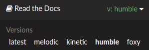

ROS Industrial Training
===========================================

Welcome to the ROS-Industrial training page!

The content on this site is divided into several sessions, each of which is focused on building
skills in a particular area. The main sessions first introduce you to ROS itself before moving on to
ideas specific to ROS-Industrial. Afterwards, deeper exploration is encouraged with some full scale
application demos, which provide a good sense of what a real ROS application entails. Finally, some
advanced modules are provided which focus on specific ROS tools or capabilities.

We are currently in the process of updating much of our training content from ROS1 to ROS2.
Currently, the ROS basics sessions are written to teach ROS2 while much of the rest of the material still
uses ROS1. The old ROS1 material can be found by selecting a different version using the tab at the
bottom left of the page.

..
   For developers: the site contents are listed in both normal ReST and in Sphinx toctrees below for
   more flexibility in how the table of contents is presented on the home page. If you make a change
   here, make sure you also make the corresponding change in the toctree directives below which
   define the contents of the sidebar.

Getting Started
---------------

Setup
~~~~~

- :doc:`PC Setup <_source/setup/PC-Setup---ROS>`
- :doc:`IDE Setup <_source/setup/IDE-Setup>`

Prerequisites
~~~~~~~~~~~~~

C++
***

- `MIT Introduction to C++ <http://ocw.mit.edu/courses/electrical-engineering-and-computer-science/6-096-introduction-to-c-january-iap-2011/assignments/>`_
- `Bruce Eckel Thinking in C++ Vol. 1 <http://vergil.chemistry.gatech.edu/resources/programming/pdf/TIC2Vone.pdf>`_
- `Bruce Eckel Thinking in C++ Vol. 2 <https://web.mit.edu/merolish/ticpp/TicV2.html>`_

Linux Fundamentals
******************

:download:`Slides <_downloads/slides/ROS-I Basic Developers Training - Session 0.pdf>`

- :doc:`0.1 - Intro to Ubuntu GUI <_source/prerequisites/Navigating-the-Ubuntu-GUI>`
- :doc:`0.2 - The Linux File System <_source/prerequisites/Exploring-the-Linux-File-System>`
- :doc:`0.3 - Using the Terminal <_source/prerequisites/The-Linux-Terminal>`

Session 1 - ROS Concepts and Fundamentals (ROS2)
------------------------------------------------

:download:`Slides <_downloads/slides/ROS-I Basic Developers Training (ROS2) - Session 1.pdf>`

- :doc:`1.0 - ROS Setup <_source/session1/0-ROS-Setup>`
- :doc:`1.1 - Create a Workspace <_source/session1/1-Create-ROS-Workspace>`
- :doc:`1.2 - Installing Packages <_source/session1/2-Installing-Existing-Packages>`
- :doc:`1.3 - Packages and Nodes <_source/session1/3-Creating-a-ROS-Package-and-Node>`
- :doc:`1.4 - Topics and Messages <_source/session1/4-Topics-and-Messages>`

Session 2 - Basic ROS Applications (ROS2)
-----------------------------------------

:download:`Slides <_downloads/slides/ROS-I Basic Developers Training (ROS2) - Session 2.pdf>`

- :doc:`2.0 - Services <_source/session2/0-Services>`
- :doc:`2.1 - Launch Files <_source/session2/2-Launch-Files>`
- :doc:`2.2 - Parameters <_source/session2/3-Parameters>`

Session 3 - Motion Control of Manipulators
------------------------------------------

:download:`Slides <_downloads/slides/ROS-I Basic Developers Training (ROS2) - Session 3.pdf>`

- :doc:`3.0 - Intro to URDF <_source/session3/0-Intro-to-URDF>`
- :doc:`3.1 - Workcell XACRO <_source/session3/1-Workcell-XACRO>`
- :doc:`3.2 - Transforms using TF <_source/session3/2-Coordinate-Transforms-using-TF>`
- :doc:`3.3 - Build a MoveIt Package <_source/session3/3-Build-a-MoveIt-Package>`
- :doc:`3.4 - Motion Planning using RViz <_source/session3/4-Motion-Planning-RVIZ>`

Session 4 - Motion Planning and Perception
------------------------------------------

:download:`Slides <_downloads/slides/ROS-I Basic Developers Training (ROS2) - Session 4.pdf>`

- :doc:`4.0 - Motion Planning using C++ <_source/session4/0-Motion-Planning-CPP>`
- :doc:`4.1 - Intro to Perception <_source/session4/2-Introduction-to-Perception>`

Application Demos
-----------------

- :doc:`Demo 1 - Perception-Driven Manipulation <_source/demo1/index>`

Advanced Topics
---------------

Session 5 - Perception Pipeline
-------------------------------

:download:`Slides <_downloads/slides/ROS-I Advanced Developers Training - Building A Perception Pipeline.pdf>`

- :doc:`5.0 - Building a Perception Pipeline <_source/session5/Building-a-Perception-Pipeline>`
- :doc:`5.1 - Simple PCL Interface for Python <_source/session5/Simple-PCL-Interface-for-Python>`
- :doc:`5.2 - OpenCV Image Processing (Python) <_source/session5/OpenCV-in-Python>`

Session 6 - ROS Tools
---------------------

- :doc:`6.0 - Documentation Generation <_source/session6/Documentation-Generation>`
- :doc:`6.1 - Using rqt tools for Analysis <_source/session6/Using-rqt-tools-for-analysis>`

Session 7 - ROS2 Topics
-----------------------

- :doc:`7.0 - ROS2 basics <_source/session7/ROS2-Basics>`
- :doc:`7.1 - ROS1 to ROS2 porting <_source/session7/ROS1-to-ROS2-porting>`

Session 8 - Motion Planning
---------------------------

:download:`Slides <_downloads/slides/ROS-I Advanced Developers Training - Motion Planning with Tesseract.pdf>`

- :doc:`8.0 - Motion Planning with Tesseract <_source/session8/Motion-Planning-with-Tesseract>`

Session 9 - Cameras and Calibration
-----------------------------------

:download:`Slides <_downloads/slides/ROS-I Advanced Developers Training - Cameras and Calibration.pdf>`

- :doc:`9.0 - Cameras and Calibration <_source/session9/Cameras-and-Calibration>`

Archives
--------

- :doc:`A.0 - Actions <_source/_archives/1-Actions>`
- :doc:`A.1 - Intro to Descartes <_source/_archives/1-Descartes-Path-Planning>`
- :doc:`A.2 - Advanced Descartes Path Planning <_source/_archives/Advanced-Descartes-Path-Planning>`
- :doc:`A.3 - Introduction to STOMP <_source/_archives/Introduction-to-STOMP>`
- :doc:`A.4 - Unit Testing <_source/_archives/Unit-Testing>`
- :doc:`A.5 - ROS Style Guide and ros_lint <_source/_archives/Style-Guide-and-ros_lint>`
- :doc:`A.6 - Introduction to ROS with Docker and Amazon Web Services (AWS) <_source/_archives/Docker-AWS>`
- :doc:`A.7 - Using the ROS1-ROS2 bridge <_source/_archives/ROS1-ROS2-bridge>`
- :doc:`Demo 2 - Descartes Planning and Execution <_source/_archives/demo2/index>`
- :doc:`Demo 3 - Optimization Based Path Planning <_source/_archives/demo3/index>`

.. toctree::
    :hidden:
    :caption: Getting Started
    :maxdepth: 1

    PC Setup <_source/setup/PC-Setup---ROS>
    IDE Setup <_source/setup/IDE-Setup>

    MIT Introduction to C++ <http://ocw.mit.edu/courses/electrical-engineering-and-computer-science/6-096-introduction-to-c-january-iap-2011/assignments/>
    Bruce Eckel Thinking in C++ Vol. 1 <http://vergil.chemistry.gatech.edu/resources/programming/pdf/TIC2Vone.pdf>
    Bruce Eckel Thinking in C++ Vol. 2 <https://web.mit.edu/merolish/ticpp/TicV2.html>

    0.1 - Intro to Ubuntu GUI <_source/prerequisites/Navigating-the-Ubuntu-GUI>
    0.2 - The Linux File System <_source/prerequisites/Exploring-the-Linux-File-System>
    0.3 - Using the Terminal <_source/prerequisites/The-Linux-Terminal>

.. toctree::
    :hidden:
    :caption: ROS Basics (ROS2)
    :maxdepth: 1

    1.0 - ROS Setup <_source/session1/0-ROS-Setup>
    1.1 - Create a Workspace <_source/session1/1-Create-ROS-Workspace>
    1.2 - Installing Packages <_source/session1/2-Installing-Existing-Packages>
    1.3 - Packages and Nodes <_source/session1/3-Creating-a-ROS-Package-and-Node>
    1.4 - Topics and Messages <_source/session1/4-Topics-and-Messages>
    2.0 - Services <_source/session2/0-Services>
    2.1 - Launch Files <_source/session2/2-Launch-Files>
    2.2 - Parameters <_source/session2/3-Parameters>

.. toctree::
    :hidden:
    :caption: ROS-Industrial Basics (ROS2)
    :maxdepth: 1

    3.0 - Intro to URDF <_source/session3/0-Intro-to-URDF>
    3.1 - Workcell XACRO <_source/session3/1-Workcell-XACRO>
    3.2 - Transforms using TF <_source/session3/2-Coordinate-Transforms-using-TF>
    3.3 - Build a MoveIt Package <_source/session3/3-Build-a-MoveIt-Package>
    3.4 - Motion Planning using RViz <_source/session3/4-Motion-Planning-RVIZ>
    4.0 - Motion Planning using C++ <_source/session4/0-Motion-Planning-CPP>
    4.1 - Intro to Perception <_source/session4/2-Introduction-to-Perception>

.. toctree::
    :hidden:
    :caption: Application Demos
    :maxdepth: 1

    Demo 1 - Perception-Driven Manipulation <_source/demo1/index>

.. toctree::
    :hidden:
    :caption: Advanced Topics
    :maxdepth: 1

    5.0 - Building a Perception Pipeline <_source/session5/Building-a-Perception-Pipeline>
    5.1 - Simple PCL Interface for Python <_source/session5/Simple-PCL-Interface-for-Python>
    5.2 - OpenCV Image Processing (Python) <_source/session5/OpenCV-in-Python>
    6.0 - Documentation Generation <_source/session6/Documentation-Generation>
    6.1 - Using rqt tools for Analysis <_source/session6/Using-rqt-tools-for-analysis>
    7.0 - ROS2 basics <_source/session7/ROS2-Basics>
    7.1 - ROS1 to ROS2 porting <_source/session7/ROS1-to-ROS2-porting>
    8.0 - Motion Planning with Tesseract <_source/session8/Motion-Planning-with-Tesseract>
    9.0 - Cameras and Calibration <_source/session9/Cameras-and-Calibration>

.. toctree::
    :hidden:
    :caption: Archives
    :maxdepth: 1

    A.0 - Actions <_source/_archives/1-Actions>
    A.1 - Intro to Descartes <_source/_archives/1-Descartes-Path-Planning>
    A.2 - Advanced Descartes Path Planning <_source/_archives/Advanced-Descartes-Path-Planning>
    A.3 - Introduction to STOMP <_source/_archives/Introduction-to-STOMP>
    A.4 - Unit Testing <_source/_archives/Unit-Testing>
    A.5 - ROS Style Guide and ros_lint <_source/_archives/Style-Guide-and-ros_lint>
    A.6 - Introduction to ROS with Docker and Amazon Web Services (AWS) <_source/_archives/Docker-AWS>
    A.7 - Using the ROS1-ROS2 bridge <_source/_archives/ROS1-ROS2-bridge>
    Demo 2 - Descartes Planning and Execution <_source/_archives/demo2/index>
    Demo 3 - Optimization Based Path Planning <_source/_archives/demo3/index>
